# CATALOGS

A catalog is a container for your products arranged by certain criteria, i.e. it is a set of data at a given time compiled to be transferred via certain channels. Catalog's content may be modified whenever needed via the TreoPIM functionality.

Catalogs, as well as channels, form the basis of the multichannel publication of your products data. They allow you to manage your range of products and carry out your multichannel strategy in the most flexible manner.

With the help of catalogs you can create as many versions of your products as you need, preserving the ability to modify your data within your company exclusively and not worrying about possible changes made by your suppliers during the data transfer.

The catalog structure can be different for each user, based on their needs. For instance, catalogs can be used to segment your range of products for further export of the product data to certain channels, as well as to store historical information about your products (e.g. "Winter jackets 2019" and "Winter jackets 2020").

The multi-catalog function is beneficial both for manufacturers, wholesalers, and retailers due to its ability to meet all their specific needs and requirements. For instance, manufacturers can easily enlarge/shorten their range of products on the basis of their already existing catalog(s). At the same time, wholesalers or retailers get a powerful tool to organize and systematize all the product information collected from different sources into one proper master catalog (and then create as many versions of it as needed) in a very flexible manner. There is no need to spend much time on creating a brand new catalog from scratch – just edit what you already have with the help of the TreoPim multi-catalog feature!

## Creating and Editing a Catalog

To create a catalog, go to the catalogs page and click the "Create Catalog" button:

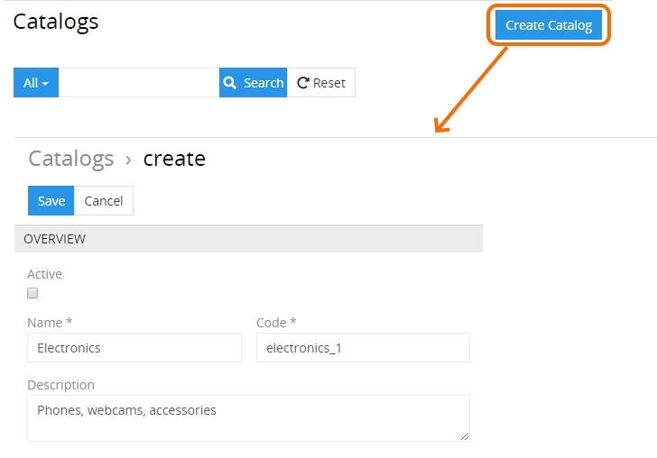

Here enter the desired name for your catalog being created; its code is automatically generated based on the entered name. The catalog description is an optional field and can be left empty.

_**TIP:**_ *Give your catalog a clear name that will help you quickly identify its destination and target audience.*

Click the "Save" button to create your catalog.

_**NOTE:**_ *If the attribute code is not unique, the  error message will appear notifying you about it.* 

Then you will be taken to the edit view of the newly created catalog:

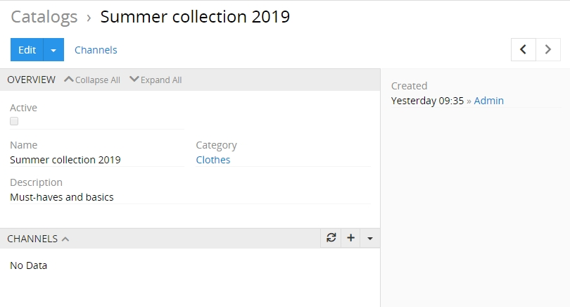

Here you can activate or deactivate your catalog by setting or removing the "Active" checkbox correspondingly, edit its name, code, description, if any.

You can also add [categories](#categories) and [products](#products) to your catalog on this page. The details are given later in this article.

The ability to duplicate the catalog is also available on the catalog edit view page in the "Edit" drop-down list:

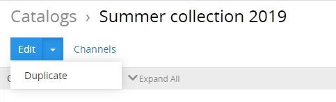

The catalog [duplication](#duplication) functionality is described in detail later in this article.

Catalogs can be viewed and edited right from their list view page:

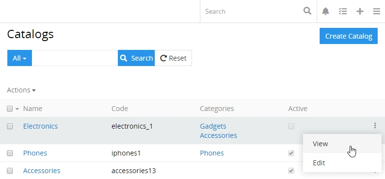

Alternatively, click the desired catalog to go to its edit view page.

### Categories

On the edit view page of the catalog you can assign a category (or several categories) to your catalog using the "Select" button:

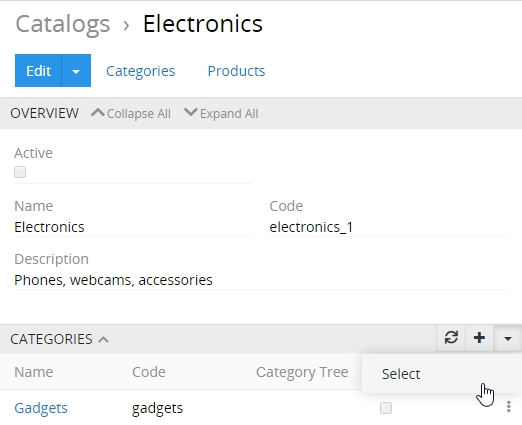

On the "Categories" page that appears, choose the desired category (or categories) from the list and press the  button to link the item(s) to the catalog.

_**TIP:**_ *Please, note that only root categories should be linked to the catalogs, which means that all catalog products may have only those categories that are related to the selected category tree(s).*

_**NOTE:**_ *To modify the list of available categories, please, contact your administrator.*

### Products

A list of products present in this catalog, if any, is displayed on the "Products" panel.

To see all products available in the given catalog, use the "Show full list" button:

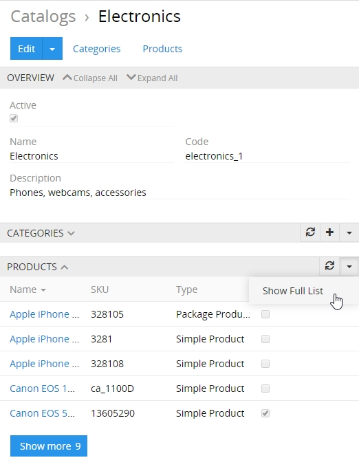

## Catalog Actions

Select the desired catalog in the list to enable the "Actions" drop-down menu. TreoPIM offers you a number of actions to be performed with the catalogs:

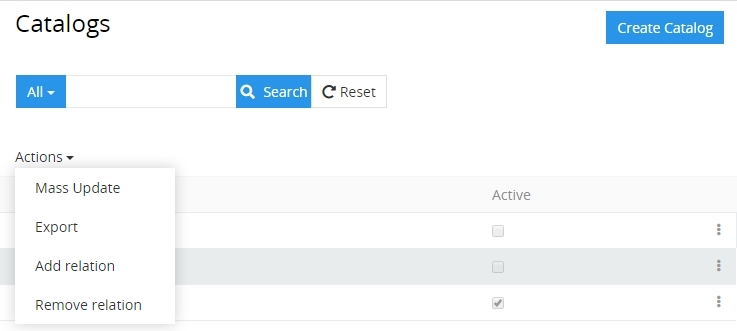

They are all described in detail below.

### Mass Update

To update more than one catalog at the same time, select the desired items in the catalogs list and use the "Mass update" option from the "Actions" drop-down menu. On the "Catalogs > Mass update" page, select the desired field(s) for updating:

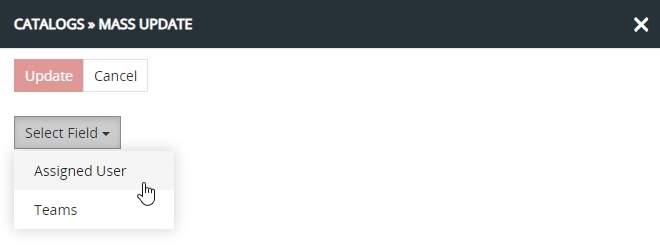

_**NOTE:**_ *To have a longer list of fields available for updating, please, contact your administrator.*

Click the "Update" button to perform the operation.

### Export

To export your catalog data in the Excel or CSV format, select the desired item(s) in the catalogs list and use the "Export" option from the "Actions" drop-down menu. On the export page, select the desired target format from the drop-down list and define the field(s) for exporting or select the "Export all fields" option to export all data available in the catalog(s):

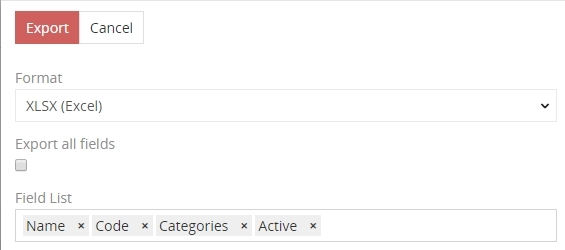

Click the "Export" button to complete the operation. The resulting file with the exported data will be automatically downloaded in your browser.

### Adding / Removing a Relation

You can relate a catalog with any entity existing in the system. To do this, select the desired item(s) in the catalogs list and use the "Add relation" option from the "Actions" drop-down menu. On the "Add Relation" page that appears, choose the desired entity from the corresponding list, select the items of the defined entity to relate to the catalog and click the "Apply Relation" button to complete the action:

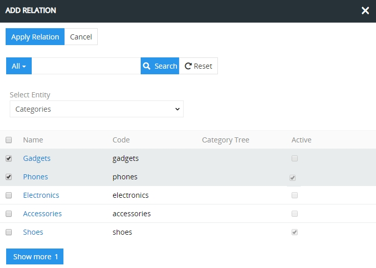

_**NOTE:**_ *Relations to products and categories are available by default. To be able to relate more entities to the catalog, please, contact your administrator.*

To remove a relation from the catalog, use the "Remove relation" option from the "Actions" drop-down menu.

You need to refresh the page to see the changes.

## Duplication

If you need to create a new catalog on the basis of the existing one, open the desired catalog and use the "Duplicate" command from the "Edit" drop-down menu on the catalog view page:

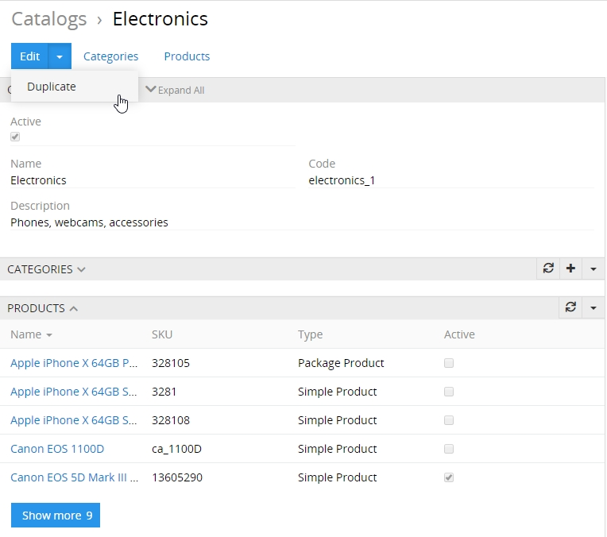

On the common catalog creation page all the fields will be filled in with the values from the catalog being duplicated. Edit the "Code" field to make the new catalog unique and click the "Save" button:

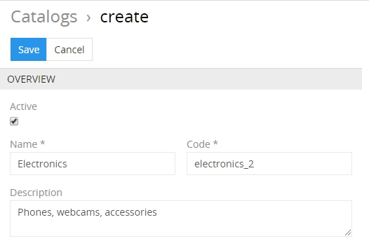

As a result, the catalog is 100% duplicated together with all its products.