# User Interface (UI)

The user interface (UI) includes all visible elements users see and interact with while using TreoPIM. This chapter describes all the main elements of user interface, which are the same for all entities in the system, as well as gives details on how to perform common tasks or operations in the system.

The following elements make up the TreoPIM user interface:

- [**Navigation Menu**](#navigation-menu) – to navigate through available entities.
- [**Taskbar**](#taskbar) – to help the user interact with the TreoPIM system in a more efficient way; additional information or actions are displayed here. 
- [**Search and Filtering Panel**](#search-and-filtering-panel) – to search and filter within one entity or its related entities.

Within the TreoPIM system your information may be presented in various ways:

- [**List View**](#list-view) – to view the lists of entity records.
- [**Detail View**](#detail-view) – to view the entity record details.
- [**Create View**](#create-view) – to create a new entity record in the main window.
- [**Edit View**](#edit-view) – to edit the entity record.
- [**Quick Detail View (Pop-up)**](#quick-detail-view-small-detail-view) – to view the record details in the pop-up window.
- [**Quick Edit View (Pop-up)**](#quick-edit-view) – to edit the record detail in the pop-up window.
- [**Quick Create View**](#quick-create-view) – to create a new entity record in the pop-up window.

## Sign in (Login)

To sign in to TreoPIM, enter your username and password and click "Login". You will be automatically remembered, until you sign out. 

### Password Recovery

To recover your password, please click on the "Forgot Password?" text link and enter your username and email address.

## Navigation Menu

The navigation menu in the default TreoPIM theme is the menu placed on the left side of your user interface. It allows you to open list views for all entities in the system.

The navigation menu can be configured by your administrator according to your needs.

Each user can customize his/her own navigation menu in the "User Interface" section of the user ["Preferences"](#user-preferences) page:

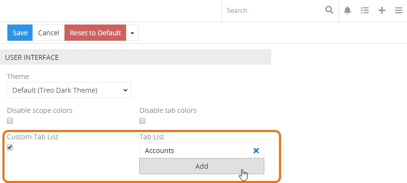

Here select the "Custom Tab List" option and add the desired tabs using the "Add" button.

## Taskbar

Taskbar is a top panel of the TreoPIM user interface:

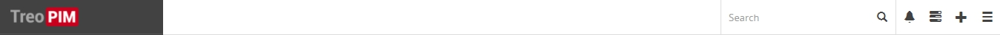

A taskbar consists of a global search field and some functional icons that help you work and collaborate within the TreoPIM system.

### Global Search

You can search all the records existing in the TreoPIM system using the global search functionality. Use the search form on the taskbar for it:

 

### Desktop Notifications

TreoPIM uses two types of notifications: email notifications and system notifications (desktop notifications). Generally, email and desktop notifications are configured globally, for all users.

User can receive notifications in case when:
- a record is assigned to him;
- changes are made to the record he is following.
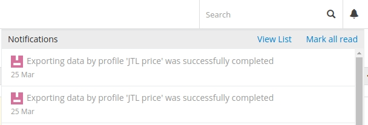

To view the notification details, click "View List" in the upper right corner of the notifications panel.

### Queue Manager

Queue Manager is opened in the pop-up window for each operation executed displaying its status and a progress circle for the currently run operation:

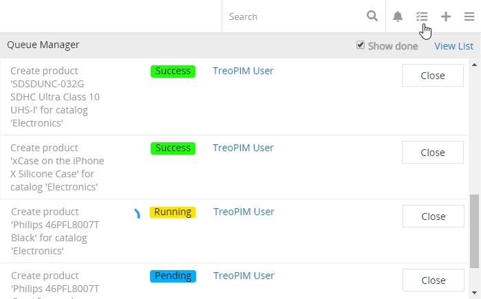

In the Queue Manager you will see the most recent TreoPIM operations, which were executed in the background mode or run automatically via scheduled jobs, i.e latest imports and exports. To view the details of the performed operations, click "View List" in the upper right corner of the Queue Manager.

### Quick Create

To create new records from anywhere, click the quick create icon in the upper right corner of the taskbar on any TreoPIM page and choose the entity for the record to be created:

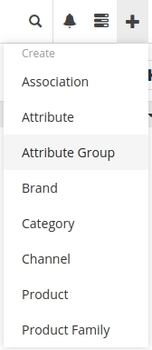

The [quick create view](#quick-create-view) page will be opened.

_**NOTE:**_ *To modify (extend or shorten) the entity list available in the quick create menu, please, contact your administrator.*

## Search and Filtering Panel

Searching and filtering allow you to quickly focus on the records you want to see. The description of various searching and filtering options available for you in the TreoPIM system is given below. 

Search and filtering sections are automatically available on each entity list view:

 
*Search and filter on the products list view page*

Searching works on the current entity records, while filtering works also on the related records, which are configured by the administrator.

To perform a search operation, enter your search query into the corresponding field and hit the "Enter" key on your keyboard or click the  button.

To filter your entity records, open the filter drop-down list and set the desired checkbox(es). To clear all filters, click the "Reset" button, located to the right of the search field:

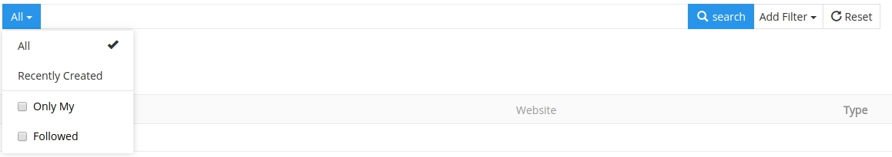 

Use the [global search](#global-search) if you wish to search globally across all the entities in the system.

By default, search is performed through all the records, which attributes start with the search string. If you want to search for the records, which attributes contain the search string, please, use the "%" symbol before your search string (without space); the use of "%" at the end of the search string is not necessary.

The fields available for searching can be configured by developers in the metadata of the appropriate entity.

You can have one or more filters based on a certain field for all field types besides the following:
  - Boolean;
  - Array;
  - Multi-Enum;
  - Enum;
  - Related entities.

A field of any of these types can be used as a filter only once, because there is no need for it.

### Logical Operators

The system behavior is different for the OR and AND logical operators:

- Currently the use of these operators in the search field is not possible.

- Operator AND is automatically applied between filters set up for different fields, e.g. "name" and "brand".

- Operator OR is automatically applied between filters set up for the same field, e.g. both filters set up for "name".

Logical operator NOR is directly not available, but can be set by defining specific filter criteria for almost each field type.

### Available Filtering Criteria

Depending of the field type, you can apply the following filtering criteria:

| **Field Type**                              | **Filtering Criteria** | **Input Value**                                            |
| :------------------------------------------ | :--------------------- | :--------------------------------------------------------- |
| **Array, Multi-Enum*                        | –                      | Value list, multiselect                                    |
| *Address*                                   | –                      | Input field                                                |
| *Boolean*                                   | –                      | Checkbox                                                   |
| *Auto-increment, Currency,  Integer, Float* | Is Not Empty           | –                                                          |
|                                             | Is Empty               | –                                                          |
|                                             | Equals                 | Input field                                                |
|                                             | Not Equals             | Input field                                                |
|                                             | Greater Than           | Input field                                                |
|                                             | Less Than              | Input field                                                |
|                                             | Greater Than or Equals | Input field                                                |
|                                             | Less Than or Equals    | Input field                                                |
|                                             | Between                | 2 Input fields                                             |
| *Date, DateTime*                            | Last 7 Days            | –                                                          |
|                                             | Ever                   | –                                                          |
|                                             | Is Empty               | –                                                          |
|                                             | Current Month          | –                                                          |
|                                             | Last Month             | –                                                          |
|                                             | Next Month             | –                                                          |
|                                             | Current Quarter        | –                                                          |
|                                             | Last Quarter           | –                                                          |
|                                             | Current Year           | –                                                          |
|                                             | Last Year              | –                                                          |
|                                             | Today                  | –                                                          |
|                                             | Past                   | –                                                          |
|                                             | Future                 | –                                                          |
|                                             | Last X Days            | Input field                                                |
|                                             | Next X Days            | Input field                                                |
|                                             | Older Than X Days      | Input field                                                |
|                                             | After X Days           | Input field                                                |
|                                             | On                     | Date picker                                                |
|                                             | After                  | Date picker                                                |
|                                             | Before                 | Date picker                                                |
|                                             | Between                | 2 Input fields                                             |
| *Enum*                                      | Any Of                 | Value list, multiselect                                    |
|                                             | None Of                | Value list, multiselect                                    |
|                                             | Is Empty               | –                                                          |
|                                             | Is Not Empty           | –                                                          |
| *Number, Varchar, Text,  URL, Wysiwyg*      | Starts With            | Input field                                                |
|                                             | Contains               | Input field                                                |
|                                             | Equals                 | Input field                                                |
|                                             | End With               | Input field                                                |
|                                             | Is Like (%)            | Input field                                                |
|                                             | Not Contains           | Input field                                                |
|                                             | Not Equals             | Input field                                                |
|                                             | Is Not Like (%)        | Input field                                                |
|                                             | Is Empty               | –                                                          |
|                                             | Is Not Empty           | –                                                          |
| *Related Entity  (as n:1 relation)*         | Is                     | Related entity record, select                              |
|                                             | Is Empty               | –                                                          |
|                                             | Is Not Empty           | –                                                          |
|                                             | Is Not                 | Related entity record, select                              |
|                                             | Any Of                 | Related entity records, multiselect                        |
|                                             | Is Empty               | –                                                          |
|                                             | Is Not Empty           | –                                                          |
|                                             | None Of                | Related entity records, multiselect                        |
| *Related Entity  (as n:m relation)*         | Is                     | Related entity record, select                              |
|                                             | Any Of                 | Related entity records, multiselect                        |
|                                             | Is Empty               | –                                                          |
|                                             | Is Not Empty           | –                                                          |
|                                             | None Of                | Related entity records, multiselect                        |
| *Related Entity  (as n:m relation)*         | Is                     | Related entity record, select                              |
|                                             | Any Of                 | Related entity records, multiselect                        |
|                                             | Is Empty               |                                                            |
|                                             | Is Not Empty           |                                                            |
|                                             | None Of                | Related entity records, multiselect                        |
| *Image, File, Attachment Multiple*          | –                      | Filtering for these field types is not possible  (for now) |

### Automatic Search Mask Recognition *(in development)*

TreoPIM has automatic search mask recognition. This can be considered as a quick search function, i.e. when you start typing, TreoPIM automatically determines the search mask type of your search string. Automatic search mask recognition is available for the following fields: Text, Number, Date, and Time.

Depending on the search mask type, the system searches through all entity fields of the appropriate field type. A pop-up with auto-suggestions appears with the information about field name and amount of search results for this field, i.e. "Address: 3 results", and the text link(s) to show the results.

If nothing is chosen from the auto-suggesting pop-up, click the magnifier icon to perform normal search (only through the fields listed in the metadata for this entity).

After clicking on the search results, the appropriate filter will be set automatically and the search field will be left empty.

|   **Search Mask Type**  |        **Field Types to Be Searched**        | **Applied Filter Criteria** |
|:-----------------------|:--------------------------------------------|:---------------------------|
| Теxt, e.g. "treo 123"   | Address, Number, Varchar, Text, URL, Wysiwyg | Starts with                 |
| %Text, e.g. "%treo 123" | Address, Number, Varchar, Text, URL, Wysiwyg | Consists                    |
| Numbers, e.g. "123"     | Address, Number, Varchar, Text, URL, Wysiwyg | Starts with                 |
| Numbers, e.g. "123"     | Auto-increment, Currency, Integer, Float     | Is                          |
| Date, e.g. "12.12.2018" | Date, DateTime                               | On                          |

### Predefined Search Filters

Predefined search filters are available in the drop-down menu on the left of the search field on any entity list view page:

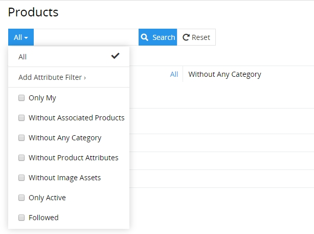

To extend the list, please save your custom search filters for the desired entities, as described below, or contact your developer.

### Custom Search Filters

To save a custom search filter, select the "Add filter" > "`desired filter`" option from the filtering drop-down list:

 

The selected filter will be added to the current page:

If needed, click the  button to remove the added filter.

#### Templates

You can create custom search filter templates. To do this, add the desired filters as described above and select the "Save filter" option from the filtering drop-down list:

On the "Save filters" page that appears, enter the name for the filter(s) and click the "Save" button to create the template. As a result, your search filter template will be added to the filtering drop-down list and set as a currently applied filter: 

To remove your custom search filter template, use the "Remove filter" option from the filtering drop-down list:

To complete the action, confirm your decision in the confirmation box that appears on top of the page.

## Breadcrumb Navigation

TreoPIM comes with breadcrumb navigation on each page in the system. Breadcrumb navigation is a form of a path-style clickable navigation, which links the user back to the prior website page in the overall online route. It reveals the path the user took to arrive to the given page. The ">" symbol separates out the hierarchical search order from beginning to end and may look something like:
`Home Page > Section Page > Subsection Page`

## User Menu

Click the hamburger icon in the upper right corner of the user interface to open the user menu:

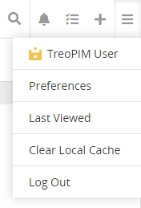

### User Account

There are many configuration options available to users once logged into the system. Click your username to open your user account.

By default, your **user profile** is opened:

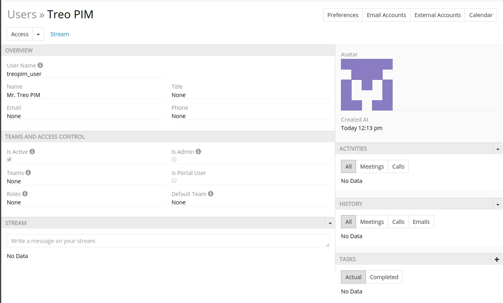

#### User Profile

Click the "Access" button to see your current permissions within the system:

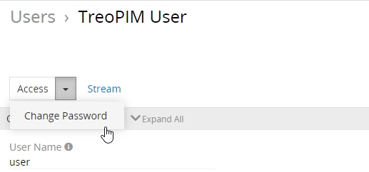

_**NOTE:**_ *By default, users have access to changing their password only. To receive more permissions, please, contact your administrator.*

To change your user password, select the corresponding option in the "Access" drop-down list and complete the operation on the "Change Password" page:

You can also manage your team and access control, if you have the corresponding permissions.

At the bottom of the screen you will see your personal activity stream:

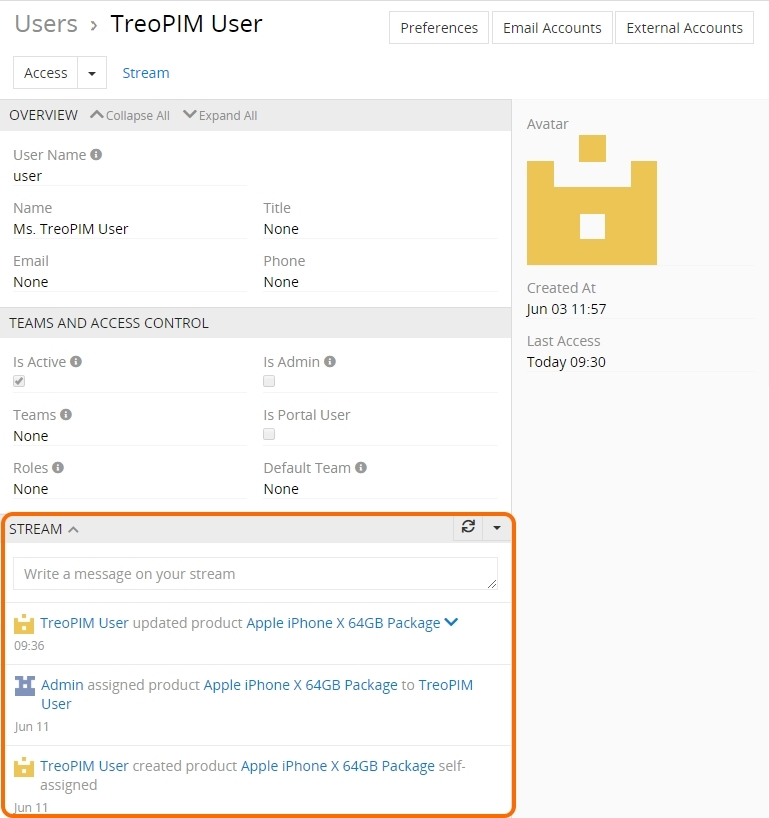 

You can manage the types of activity to be displayed here in the corresponding drop-down list:

Recent updates and comments about certain entity records are displayed on the activity stream panel, making it an excellent way of keeping track of the changes in TreoPIM. You can also create a post in the corresponding message box right on the "Stream" panel.

#### User Preferences

If you want to edit your user preferences, select the "Preferences" option from the user drop-down menu or use the "Preferences" button on the user profile page and make the desired changes on the "LOCALE", "MISC", "USER INTERFACE", "SMTP" panels of the current user page.

To reset preferences to default, please click the "Reset to default" button.

 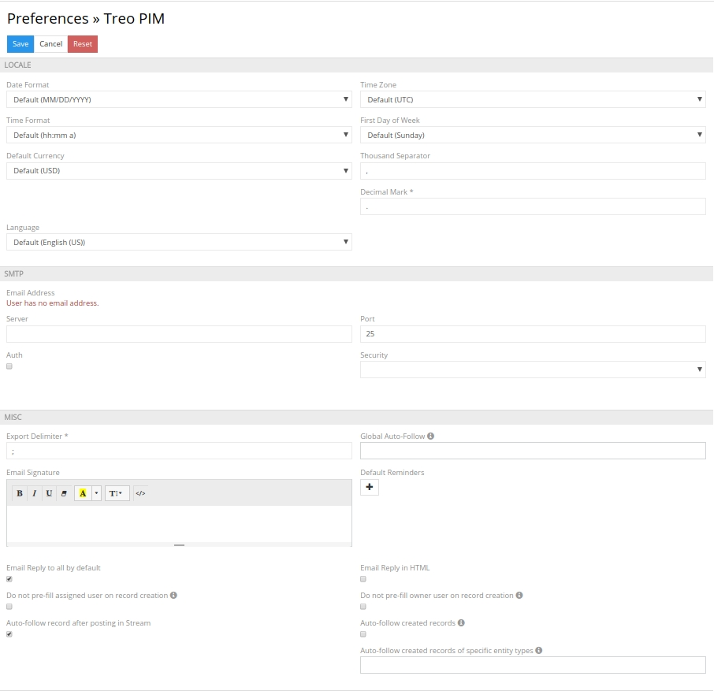

#### Email Accounts

TreoPIM works with IMAP mail accounts, with or without SSL protection. TreoPIM is able to send emails via SMTP Server, also with or without SSL protection, which can be enabled or not.

To open your personal email accounts, click the "Email Accounts" button; the list of the existing accounts, if any, will be displayed on the "Personal Email Accounts" page:

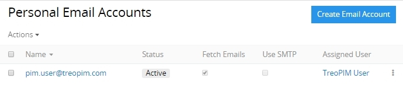 

Each user can have one or more private email accounts that can be be viewed, edited or removed right from the "Personal Email Accounts" list view page:

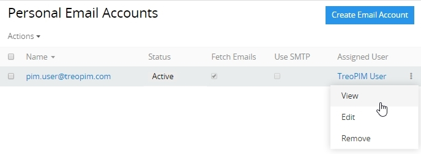

##### Creating

Click the "Create Email Account" button; the following creation page will open: 

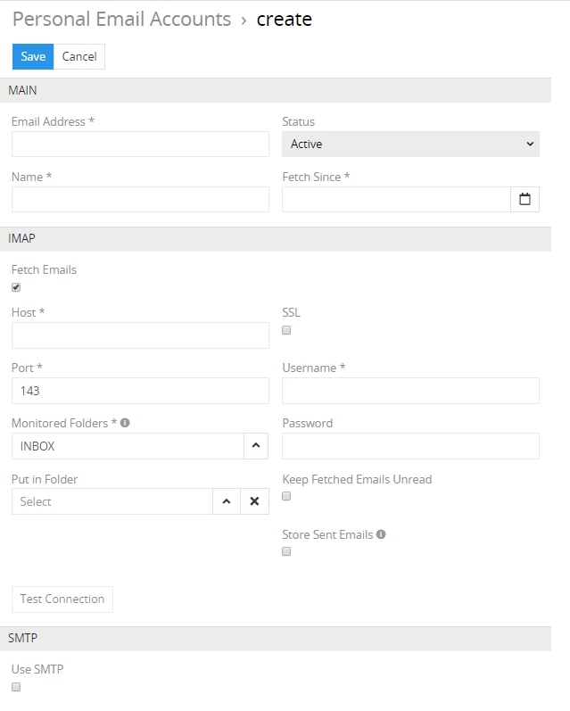

Here and fill in the required fields (marked with an asterisk) and configure the IMAP, SMTP options available in accordance with your email account server.

#### External Accounts

Currently not available.

#### User Interface Settings

Select the "Custom Tab List" checkbox to enable a custom navigation menu. Using the "Add" button select the entities to be linked to your custom [navigation menu](#navigation-menu).

[Dashboard](#dashboard) layout and [dashlet](#dashlets) settings are also available for editing on the "User interface" panel:

 

The same options are available on the TreoPIM starting page:

Click the editing button and enter a name for your dashboard in the corresponding field of the "Edit dashboard" pop-up page and hit "Enter":

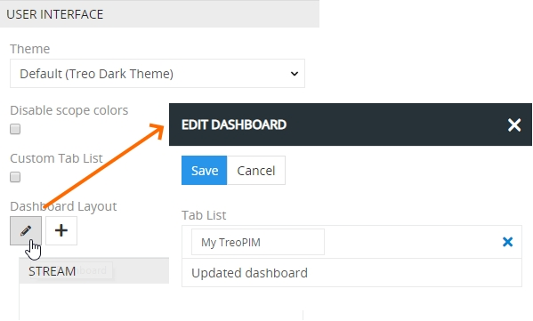

Click the "Save" button to finish creating the new dashboard. Use the same pencil button if you wish to rename or remove the existing dashboards.

Using the  button add as many dashlets as you need. The added dashlets can be resized using the double-headed arrow in the bottom right corner of each dashlet. Click "Edit" to modify the added dashlets, if needed.

To rearrange your dashboard view, drag-and-drop the dashlets right on the "User interface" panel:

### Last Viewed

Select the "Last Viewed" option from the main drop-down menu to see the history of your visited pages within the TreoPIM system:

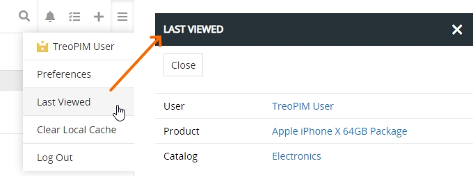

### Clear Local Cache

TreoPIM is a single page application (SPA). To improve the page loading time, it actively uses cache for content as well for the user interface.

If you want to be sure in getting the latest information and application functions, please use the "Clear Local Cache" option from the main drop-down menu.

_**NOTE:**_ *By default, the use of cache is disabled. To get it enabled, please, contact your administrator.*

## Dashboard

The dashboard is the default starting page of TreoPIM:

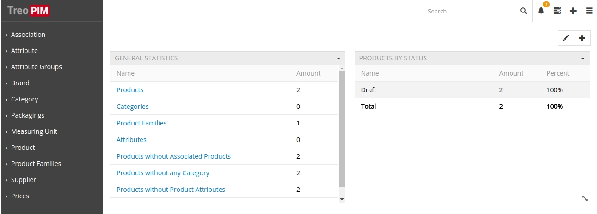

The "My TreoPIM" dashboard comes out-of-the-box and is displayed on the TreoPIM starting page by default.

Dashboards are [user customizable](#user-interface-settings), i.e. users can add, rename and delete dashboards, as well as modify the dashboard layout.

Once the dashboard is created, user can easily access it by clicking its name in the upper right corner of the TreoPIM starting page.

Creating new dashboards is useful if you wish to group a different set of dashlets, consisting of certain information of the same nature or type, to help you make the right decision.

### Dashlets

Dashlets are [user-configurable](#user-interface-settings) blocks, which can be placed via drag-and-drop anywhere on the dashboard, giving you a quick overview of your records and activity. 

Dashlets provide users with valuable information regarding records of specific entities.

#### Available Dashlets

The following dashlets are available in TreoPIM out-of-the-box:
- Channels
- General Statistics
- My Inbox
- Product Status Overview
- Product Types
- Product by Status
- Product by Tag
- Record List
- Stream

## Pages, Views and Panels

There are two types of **pages** in the TreoPIM system with the corresponding **views**:

- **List Page** – shows a table of records with main fields chosen for each entity and includes:
  - [*navigation menu*](#navigation-menu)*;*
  - [*taskbar*](#taskbar)*;*
  - [*search and filtering panel*](#search-and-filtering-panel)*;*
  - [*breadcrumb navigation*](#breadcrumb-navigation) *including page name;*
  - [*list view*](#list-view)*.*
- **Detail Page** – shows detailed information about the selected entity record and all its relations and includes:
  - [*navigation menu*](#navigation-menu)*;*
  - [*taskbar*](#taskbar)*;*
  - [*breadcrumb navigation*](#breadcrumb-navigation) *including page name;*
  - [*detail view*](#detail-view)*,* where detailed information about the currently open entity record is displayed. 

The **detail page** may also include:
- the *"Overview" panel* and some other panels, if these were configured by the administrator:

  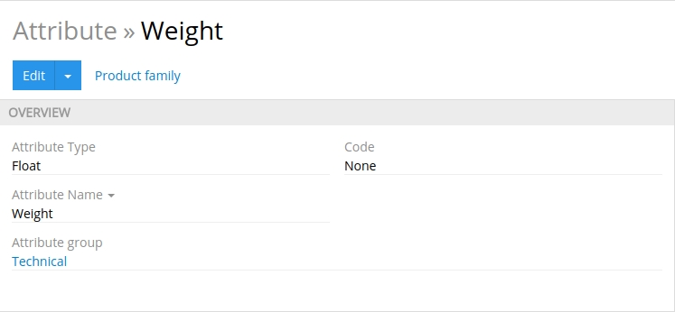

- several *small list views* for the related records, if these were configured by the administrator:
  
    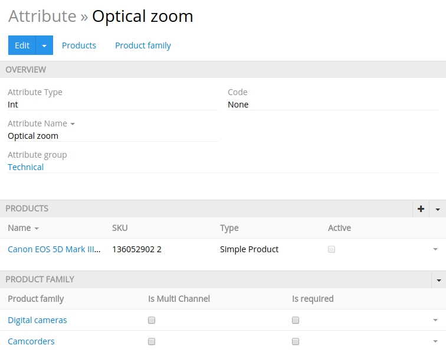

- *side view* with additional information concerning record management and activity stream, if activated for the entity.
  
Views can be shown in the main window or in a pop-up window. They consist of the panels, which can be configured by the administrator. Usually these are structured in a way to provide you with key information through the record management.

### List View

List view is shown in the main TreoPIM window and has its own layout, which can be configured by the administrator.

It is a default view to any entity that appears if you click it in the navigation menu. Here the entries belonging to this entity are displayed:

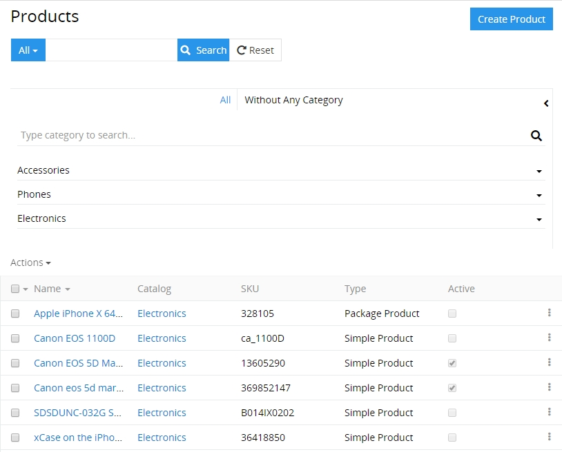

#### Mass Actions

Mass actions are to be applied to several selected entity records, i.e. records with set checkboxes:

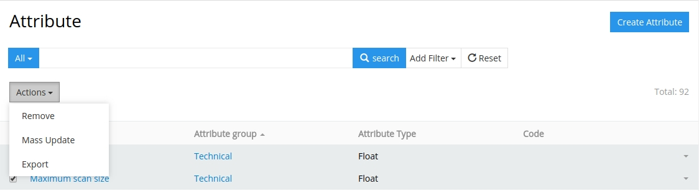

By default, the following mass actions are available for all entities: 
- **Mass Update** – to update several selected entity records at once.
- **Export** – to export the desired data fields of the selected entity records in the XLSX or CSV format.

_**TIP:**_ *Please contact your administrator if you want to extend the mass  actions list.*

If your entity is related to other entities in the system, the "Actions" menu expands, as follows:

_**NOTE:**_ *Please, keep in mind that no related entities are exported.*

_**TIP:**_ *For more advanced export features, please, use the Export Feed module.*

#### Single Record Actions

To see the available single record actions list, click the select icon on the right of the record:

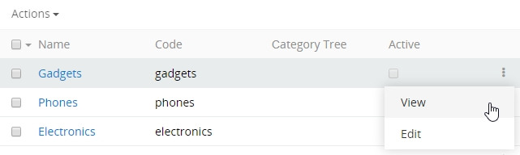

By default, the following actions are available for all entities:
- **View** – to go to the detail view of the record.
- **Edit** – to go to the detail view of the record in the edit mode.

_**TIP:**_ *Please contact your developer if you want to extend the single record actions list.*

### Detail View

The detail view is shown in the main window and has its own layout, which could be configured by the administrator.

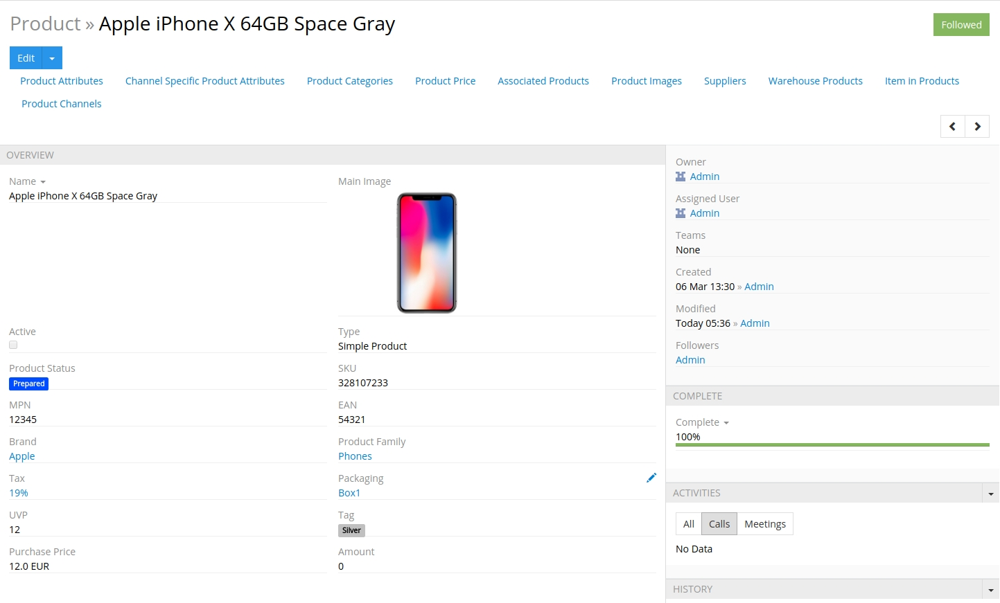

You can start following the entity record right on the detail view page. To do this, click the  button, placed in the upper right corner of your detail view page. It will turn into . Click this button again to stop following the entity record.

Navigation through the existing entity records can be done on the detail view pages using the corresponding buttons: 

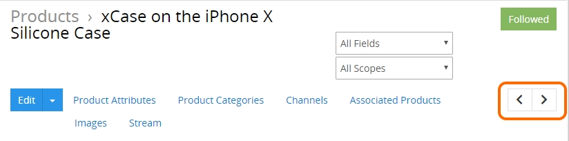

To edit the fields data on the detail view page, use [in-line editing](#in-line-editing).

#### Main Actions

The following actions are available for all entity records by default:

- **Edit** – click the "Edit" button to make changes in the given record.
- **Duplicate** – select the "Duplicate" option from the "Edit" drop-down list to go to the record creation page and enter the unique values for the record fields to be used for duplication. 

### Small List Views

Small list views are panels and pop-up windows with data on the entities related to the given entity record, shown in the main window always together with the detail view. Each entity may have as many related entities as needed.

The following actions are available for the small list view panels:
- **General actions** – applicable to all records on the related entities panel:
  
  - *Refresh* – to refresh the related entities list on the panel;
  - *Create new* – to create a new record for the related entity;
  - *Select* – to create a relation between the entity record, which is opened in the main window and the entity record, which was chosen in the pop-up window. 
  _**NOTE:**_ *Please, keep in mind that choosing some record in the pop-up window will reassign this record to the entity record, which is opened in the main window. The previous relation will be dropped, if the relation is one-to-many retrospectively.*
 
- **Single record actions** – applicable to each record of the related entities separately. The ist of actions here is usually the same as on the list view for this entity.
    

### Side View

The side view panel is used to show additional information and is shown in the main window always together with the detail view panels:

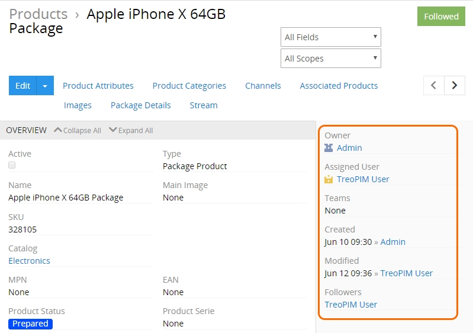

The following information is available by default on the side view panel:
 - **Owner** – who is currently responsible for the record; the value is changeable.
 - **Assigned User** – who should work on the record; the value is changeable.
 - **Teams** – which team(s) can have access to this record; values are changeable.
 - **Created** – the date and time of the record creation, as well as its author; not changeable.
 - **Modified** – the date and time of the record modification, not changeable.
 - **Followers** – who is following the changes in the record.

TreoPIM modules can add additional panels to the side view panel.

### Edit View

The edit view panel is shown in the main window and uses the layout of the detail view page. To get to it, use the "Edit" button on the detail view page. On the page that appears you see and can edit only the fields of the edited entity, i.e. no fields of the related entities can be edited here.

If you are on the quick edit view page, click the "Full form" button to get to edit view page.

### Create View

To get to the create view page, click the  button on the list view page (or in the main window) and fill in the record fields. Click the "Save" button to complete the record creation or "Cancel" to abort the operation.

Using the global "Create 'Entity'" button from the list view page brings you to the create view page. In all other cases, you will be taken to the quick create view page that will be opened in a pop-up window.

### Quick Detail View (Small Detail View)

The quick detail view is shown in a pop-up window. It is usually used to display the record details for some related entity or after using the single record action on the list view page.

### Quick Edit View

The quick edit view is shown in a pop-up window and uses the layout of the small detail view page. It is usually used to edit records for the related entities or to edit records after using the single record action on the list view page.

Click the "Full Form" button to get to the edit view page.

### Quick Create View

The quick create view is shown in a pop-up window and uses the layout of the small detail view page. It is usually used to create records for the related entities.

Click the "Full Form" button to get to the edit view page.

## Entity Records

Each entity in the system can have many records. These records are available to work with on the views described in the [**Pages, Views and Panels**](#pages-views-and-panels) section above. 

The following actions are available directly out of the box:

| **Actions** | **Available on Views**                                      |
|-------------|-------------------------------------------------------------|
| View        | Detail View, Quick View, List View                          |
| Create      | Create View, Quick Create View                              |
| Edit        | Edit View, Quick Edit View, Detail View via in-line editing |
| Remove      | List, View, Detail View                                     |
| Merge       | List View                                                   |
| Export      | List View                                                   |

If you want to make changes to some entity (e.g. add new fields, modify its views or relations), please, contact your administrator.

### In-Line Editing

With in-line editing you can change values "on the fly". This ensures quick change of field values and reduces the number of clicks to do their work.

Currently in-line editing is available on the detail view pages only. To edit the record information on these pages using the in-line editing, click  the pencil icon above the field you want to edit.

### Automatic Linking of the Related Entity Records

Each entity in the system has a certain main naming field, in most cases this is the `Name` field. These field values are automatically converted to links, leading to the detail view pages of the appropriate entity record.
