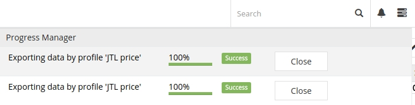
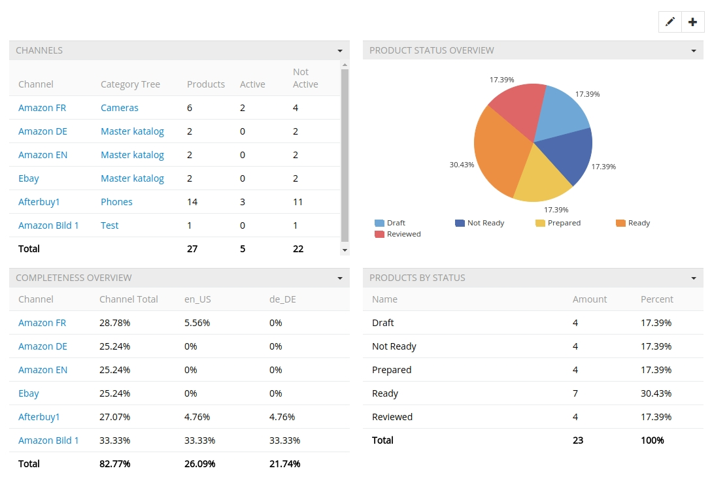

# User Interface (UI)

The user interface (UI) includes all visible elements users see and interact with while using TreoPIM. This chapter describes all the main elements of user interface, which are the same for all entities in the system, as well as how to perform common tasks or operations in the system.

The following elements make up the TreoPIM user interface:

- **Navigation Menu** – to navigate through available entities.
- **Taskbar** – to help the user interact with the TreoPIM system in a more efficient way; additional information or actions are displayed here. 
- **Search and Filtering Panel** – to search and filter within one entity or its related entities.

Within the TreoPIM system your information may be presented in various ways:

- **List View** – to view the lists of entity records.
- **Detail View** – to view the entity record details.
- **Create View** – to create a new entity record in the main window.
- **Edit View** – to edit the entity record.
- **Quick Detail View (Popup)** – to view the record details in the popup window.
- **Quick Edit View (Popup)** – to edit the record detail in the popup window.
- **Quick Create View** – to create a new entity record in the popup window.

## Sign in (Login)

To sign in to TreoPIM, enter your username and password and click on "Login". You will be automatically remembered, until you sign out. 

### Password Recovery

To recover your password, please click on the text link "Forgot Password?" and enter your username and email address.

## Navigation Menu

The navigation menu in the default TreoPIM theme is the menu placed on the left side of your user interface. It allows you to open list views for all entities in the system.

The navigation menu can be configured by your Administrator according to your needs.

Each user can customize his/her own navigation menu in the "User Interface" section of the user "Preferences" page:

Here select the "Custom Tab List" option and add the desired tabs using the "Add" button.

## Taskbar

Taskbar is a top panel of the TreoPIM user interface:

   

A taskbar consists of a global search field and some functional icons that help you work and collaborate within the TreoPIM system.

### Global Search

You can search all the records existing in the TreoPIM system using the global search functionality. Use the search form on the taskbar for it:

 

### Desktop Notifications

TreoPIM uses two types of notifications: email notifications and system notifications (desktop notifications). Generally, email and desktop notifications are configured globally, for all users.

User can receive notifications in case when:
- a record is assigned to him;
- changes are made to the record he is following.

<!-- I think we need a different screen here - w/ 2 variants of notifications -->
### Progress Manager

Progress Manager is opened in the popup window for each operation executed displaying its status and a shortcut to the operation details. 

In the Progress Manager you will see the most recent TreoPIM operations, which were executed in the background mode or run automatically via scheduled jobs, i.e latest imports and exports.

### Quick Create

To create new records from anywhere, click the Quick Create icon in the upper right corner of the taskbar on any TreoPIM page and choose the entity for the record to be created.

The quick create view will be opened:

 

To change or extend the entity list available in the quick create menu, please contact your administrator.

## Search and Filtering Panel

Searching and filtering allow you to quickly focus on the records you want to see. The description of various searching and filtering options available for you in the TreoPIM system is given below. 

Search and filtering sections are automatically available on each entity list view:

 
*Search and filter on the products list view page*

Searching works on the current entity records, while filtering works also on the related records, which are configured by the administrator.

To perform a search operation, enter your search query into the corresponding field and hit the "Enter" key on your keyboard or click the  button.

To filter your entity records, open the filter drop-down list and set the desired checkbox(es). To clear all filters, click the "Reset" button, located to the right of the search field:
 

Use the Global Search if you wish to search globally across all the entities in the system.
  
By default, search is performed through all the records, which attributes start with the search string. If you want to search for the records, which attributes contain the search string, please use the "%" symbol before your search string (without space); the use of "%" at the end of the search string is not necessary.

The fields available for searching can be configured by developers in the metadata of the appropriate entity.

You can have one or more filters based on a certain field for all field types besides the following:
  - Boolean;
  - Array;
  - Multi-Enum;
  - Enum;
  - Related entities.

A field of any of these types can be used as a filter only once, because there is no need for it.

### Logical Operators

The system behavior is different for the OR and AND logical operators:
- Currently the use of these operators in the search field is not possible.
- Operator AND is automatically applied between filters set up for different fields, e.g. "name" and "brand".
- Operator OR is automatically applied between filters set up for the same field, e.g. both filters set up for "name".

Logical operator NOR is directly not available, but can be set by defining specific filter criteria for almost each field type.

### Available Filtering Criteria

Depending of the field type, you can apply the following filtering criteria:

| Field Type                 | Filtering Criteria   | Input Value                      |
| ––––––––––––––––––––– | ––––––––––– | ––––––––––––––––––––––––––– |
| *Array, Multi-Enum*            | –           | Value list, multiselect                |
| *Address*                 | –           | Input field                      |
| *Boolean*                 | –           | Checkbox                        |
| *Auto-increment, Currency, Integer, Float* | Is Not Empty      | –                           |
|                      | Is Empty        | –                           |
|                      | Equals         | Input field                      |
|                      | Not Equals       | Input field                      |
|                      | Greater Than      | Input field                      |
|                      | Less Than       | Input field                      |
|                      | Greater Than or Equals | Input field                      |
|                      | Less Than or Equals  | Input field                      |
|                      | Between        | 2 Input fields                     |
| *Date, DateTime*              | Last 7 Days      | –                           |
|                      | Ever          | –                           |
|                      | Is Empty        | –                           |
|                      | Current Month     | –                           |
|                      | Last Month       | –                           |
|                      | Next Month       | –                           |
|                      | Current Quarter    | –                           |
|                      | Last Quarter      | –                           |
|                      | Current Year      | –                           |
|                      | Last Year       | –                           |
|                      | Today         | –                           |
|                      | Past          | –                           |
|                      | Future         | –                           |
|                      | Last X Days      | Input field                      |
|                      | Next X Days      | Input field                      |
|                      | Older Than X Days   | Input field                      |
|                      | After X Days      | Input field                      |
|                      | On           | Date picker                       |
|                      | After         | Date picker                       |
|                      | Before         | Date picker                       |
|                      | Between        | 2 Input fields                     |
| *Enum**                  | Any Of         | Value list, multiselect                |
|                      | None Of        | Value list, multiselect                |
|                      | Is Empty        | –                           |
|                      | Is Not Empty      | –                           |
| *Number, Varchar, Text, URL, Wysiwyg*   | Starts With      | Input field                      |
|                      | Contains        | Input field                      |
|                      | Equals         | Input field                      |
|                      | End With        | Input field                      |
|                      | Is Like (%)      | Input field                      |
|                      | Not Contains      | Input field                      |
|                      | Not Equals       | Input field                      |
|                      | Is Not Like (%)    | Input field                      |
|                      | Is Empty        | –                           |
|                      | Is Not Empty      | –                           |
| *Related Entity (as n:1 relation)*     | Is           | Related entity record, select             |
|                      | Is Empty        | –                           |
|                      | Is Not Empty      | –                           |
|                      | Is Not         | Related entity record, select             |
|                      | Any Of         | Related entity records, multiselect          |
|                      | Is Empty        | –                           |
|                      | Is Not Empty      | –                           |
|                      | None Of        | Related entity records, multiselect          |
| *Related Entity (as n:m relation)*     | Is           | Related entity record, select             |
|                      | Any Of         | Related entity records, multiselect          |
|                      | Is Empty        | –                           |
|                      | Is Not Empty      | –                           |
|                      | None Of        | Related entity records, multiselect          |
| *Image, File, Attachment Multiple*     | –           | Filtering for these field types is not possible (for now) |

### Automatic Search Mask Recognition *(in development)*

TreoPIM has automatic search mask recognition. This can be considered as a quick search function, i.e. when you start typing, TreoPIM automatically determines the search mask type of your search string. Automatic search mask recognition is available for the following fields: Text, Number, Date, and Time.
<!--I added "Time" - correct? -->  

Depending on the search mask type, the system searches through all entity fields of the appropriate field type. A pop-up with auto-suggestions appears with the information about field name and amount of search results for this field, i.e. "Address: 3 results", and the text link(s) to show the results.

If nothing is chosen from the auto-suggesting pop-up, click the magnifier icon to perform normal search (only through the fields listed in the metadata for this entity).

After clicking on the search results, the appropriate filter will be set automatically and the search field will be left empty.

| Search Mask Type    | Field Types to Be Searched          | Applied Filter Criteria |
| –––––––––––- | –––––––––––––––––––––– | –––––––––––- |
| Теxt, e.g. "treo 123"  | Address, Number, Varchar, Text, URL, Wysiwyg | Starts with       |
| %Text, e.g. "%treo 123" | Address, Number, Varchar, Text, URL, Wysiwyg | Consists        |
| Numbers, e.g. "123"   | Address, Number, Varchar, Text, URL, Wysiwyg | Starts with       |
| Numbers, e.g. "123"   | Auto-increment, Currency, Integer, Float   | Is           |
| Date, e.g. "12.12.2018" | Date, DateTime                | On           |

### Predefined Search Filters

Predefined search filters are available in the drop-down menu on the left of the search field on any entity list view page:

 

To extend the list, please save your custom search filters for the desired entities or contact your developer.

### Custom Search Filters

To save a custom search filter, please, contact the administrator.
<!-- Since user has no access to the "Administration" page, I suggest moving the description with the screenshot to the admin's guide, when it's created, and leave here just a sentence about contacting the admin 
To save a custom search filter, you need to do the following:

- On the "Administration > Layout Manager" page, set all the search filters you need for the desired entities and apply them.
- Click on the drop-down for predefined filters on the left of the search field.
- Click on the option Search Filter and then in the popup define the name for it and save it.
 
-->

## Breadcrumb Navigation

TreoPIM comes with breadcrumb navigation on each page in the system. Breadcrumb navigation is a form of a path-style clickable navigation, which links the user back to the prior website page in the overall online route. It reveals the path the user took to arrive to the given page. The ">" symbol separates out the hierarchical search order from beginning to end and may look something like:
`Home Page > Section Page > Subsection Page`

## User Menu

Click the hamburger icon in the upper right corner of the user interface to open the user menu:

### User Account

There are many configuration options available to users once logged into the system. Click your username to open your user account.

By default, your **user profile** is opened:

 

#### User Profile

Click the "Access" button to see your current permissions within the system:

 
<!-- Since user cannot edit this, I suggest moving the "Edit" button description to the admin guide:

- Click Edit Button to change your profile data:
- You can change: username, name, title, gender, one or more email addresses, one or more phone numbers.-->

*NOTE: By default, users have access to changing their password only. To receive more permissions, please, contact your administrator.*

To change your user password, select the corresponding option in the "Access" drop-down list and complete the operation on the "Change Password" page:

To edit your preferences, select the "Preferences" option from the user drop-down menu and make the desired changes on the user page.

You can also manage your team and access control, if you have the corresponding permissions.

At the bottom of the screen you will see your personal activity stream.

 
<!-- the screenshot above has to be changed: there HAS TO be smth displayed on the "Stream" panel-->
#### Email Accounts

TreoPIM works with IMAP mail accounts, with or without SSL protection. TreoPIM is able to send emails via SMTP Server, also with or without SSL protection, which can be enabled or not.

To open your personal email accounts, click the "Email Accounts" button; the list of the existing accounts, if any, will be displayed on the "Personal Email Accounts" page.

Each user can have one or more private email accounts.

- You can set the status of the email account to Active or Inactive

- You can set, if the emails should be fetched.

- You can define, from which date the emails should be fetched.

- You can define the folders, which should be monitored by TreoPIM. If you use external mail clients with this account please select here also the appropriate Sent folder.

- You can define, if you want to left the fetched emails unread.

- You can define, it you want to store the sent emails on your IMAP account and select, which folder should be used for it.

- It it also possible to generate a new password automatically.

 

#### External Accounts

- Actually not available.

#### Calender

- Click on the Tag Calender to open you private Calender
- Please go to Timeline to be able to see the shared calender of your colleagues.
- Please refer to Calender chapter to find more information about using Calender.

### User Preferences

- Click on the Preferences to edit
 - your personal locale settings, to define you 
  - interface language,
  - specific data presentation options (i.e. date format, time format, decimal separator etc)
 - your SMTP settings,
 - misc settings concerning system behaviour for the user.

- To reset preferences to to defaults please click on the Reset button.

 

#### User Interface Settings

- Check the checkbox Custom Tab List to enable a custom Navigation Menu for the User
- If activated please select the entities which should be linked from you custom navigation menu.
- You can edit your Dashboard Layout settings.
- Drag-and-Drop the dashlets, to reorder them on your dashboard.
 

### Last Viewed
- Click on the Last Viewed option to see the history of your visiting the pages.
### Clear Cache

- TreoPIM is Single Page Application (SPA). To improve the page loading time is uses actively cache for content as well for the user interface.
- If you want to be sure, that you will get the latest information and application functions please use this button.

## Dashboard

The dashboard is the default starting page for TreoPIM.

- By default the "My Dashboard" comes out-of-the-box and is default starting page.
- Dashboards are configurable per user.
- Users have the option to modify the dashboard layout, rename dashboards, add new dashboards and delete dashboards.
- Once a dashboard is created, users can easily access them by clicking the name of dashboard on the upper right corner of the screen then selecting the specific dashboard's name.
- Users can create new dashboards if they wish to group a different set of dashlets, which consists of certain information of same nature or type, to help the user to take the right decision.
- To create a new Dashboard click on the pen icon in the upper right corner of the display.
- In the opened popup you can create new, rename or remove dashboards.
 

### Dashlets

Dashlets are user-configurable blocks, which can be placed via drag-and-drop anywhere on the dashboard, that give you a quick overview of your records and activity. Dashlets provides users with valuable information regarding record's of specific entity. 

Dashlets can be dragged/dropped within the home page. You can add dashlets by clicking the 'Add Dashlets' link on the home page.

#### Available Dashlets

- Channel Completeness

- Locale Completeness

- Completeness Overview

- Channel Statistics (for each channel)

- Product Statistics

- Product By Status

- Product By Tag

- Product Types

 

## Pages, Views and Panels

- There are two types of Pages in the System:
 - List Page – shows a table of records with main fields, chosen for each entity.
 - Detail Page – shows detailed information about selected entity record and all its relations.
- Each User Interface (Page) in the TreoPIM besides of the elements stated above consists of Views.
- **List Page** consist of:
 - *Navigation Menu*
 - *Taskbar*
 - *Search and Filtering Panel*
 - *Breadcrumb Navigation including Page Name*
 - *List View*
- **Detail Page** consists of:
 - *Navigation Menu*
 - *Taskbar*
 - *Breadcrumb Navigation including Page Name*
 - *Detail View*, which display detailed information about opened entity record, may consist of Overview Panel and some other panels, if these were configured by Administrator.
  
 - Several *Small List Views* for related records, if these were configured by Administrator.
  
 - *Side View* with additional information concerning record management and Activity Stream, if activated for the entity. 
- Views can be shown in the Main Window or in a Popup Window.
- Views consists of the panels, which can be configured by the Administrator. Normally these are structured in the way to provide you with key information through the record management.

### List View

- List View is shown in the Main Window and has its own layout, which can be configured by Administrator.
- This is the default view to any entity, if you click on the entity in the navigation menu. Here you see the entries, which belong to this entity.
 

#### Mass Actions

- Mass Actions are to be applied to selected entity records. 
- To select several records please activate the appropriate checkboxes.
   
- The following actions are available for any entity per default: 
 - Remove - to remove the selected entity records
 - Merge - to merge the selected entity records
 - Mass Update - to mass update the selected entity records
 - Export - to export the attributes of the selected entity records 
  - You can choose the format for the data to be exported - XLSX or CSV are available
  - You can choose if you want to export all the fields or select which you would like to export.
  - Please consider no related entities are exported, please use export profile for more advanced export features.

#### Single Record Actions

- To see the available single record actions click on the select icon on the right of the record.
- Following actions are available for all entity records per default
 - View – go to the detail view of the record.
 - Edit – go to the detail view of the record in the edit mode.
 - Remove – remove the record.
   
- Please contact your Developer if you want to extend this list.

### Detail View

- Detail View is shown in the Main Window and has its own layout, which could be configured by Administrator.
- To follow the the entity record please click on the button Follow, placed in the upper right corner of your Detail View.
- You can switch to the previous and to the next record by using the appropriate icons
- To edit the fields on the Detail View you can use in-line editing.
  

#### Anchor Navigation

- Anchor navigation is automatically available on each Detail View for each entity in the system.
- Is placed directly under the Title of the Detail View.
- Use anchor navigation for quick navigation to the selected section responsible for some related entity.

#### Main Actions

Following actions are available for all entity records per default

- Edit – click on the Edit button to edit the record.
- Remove – click on the drop-down section at the main action button and select Remove to remove the record.
- Duplicate – click on the drop-down section at the main action button and select Duplicate to go to the Create View and get all the values of the record to be duplicated in the empty fields of the new record to be created.

### Small List Views

- Are shown in the Main Window always together with Detail View
- Small List Views are used as panels for related entities.
- Each Entity can have related entities, i.e Product Category is a related entity to the entity Product.
- Records for some related entity are shows in the panel for that related entity and are available to work with.
- There can be many panels for different related entities placed on the Detail View.
- In TreoPIM it is possible to configure, panels for which related entities can be placed on the Detail View for a certain entity.
- The following actions can be available to the user 
 - **Global actions** for records of related entities, typically
  - *Create New* – to create new record for related entity.
  - *Select* – to create relation between the entity record, which is opened in a Main Window and the entity record, which was chosen in the Popup Window. Please consider, that choosing some record in the Popup Window, will reassign this record to the entity record, which is opened in the Main Window. Previous relation will be dropped, if the relation is one-to-many retrospectively.
    
 - **Single record actions** for records of related entities, usually the same as on the List View for this entity.
   single-record-actions-for-related-entity.jpg

### Side View

- Is shown in the Main Windows always together with Detail View
- Side View is used to show additional infos and may also consists of several Panels, i.e tasks.
- Following information is available per default:
 - Owner – who is currently responsible for the record, value is changeable
 - Assigned User – who should work on the record, value is changeable
 - Teams – which Teams can have access to this record, values are changeable
 - Created – date, the record was created, not changeable
 - Created By – by whom the record was created, not changeable
 - Modified – date, the record was modified, not changeable
 - Modified By – by whom the record was modified, not changeable
 - Follower – who is following the changes in the record.
- Activity Stream is also placed on Side View per Default.
- TreoPIM modules can add additional panels to Side View.

#### Activity Stream

- The Activity Stream is an excellent way of keeping track of changes. 
- Activity stream in placed per default on the Side View.
- Activity Stream can be activated for any entity in the system and displays recent updates and comments about certain entity record. 
- Click on the Select Icon on the upper right of the activity stream section to choose, if you want to see
 - All changes
 - Posts only
 - Updates only
  
- To see your personal activity stream go to your user profile.

### Edit View

- Edit View is shown in the Main Window and uses the layout of Detail View.
- Click on the Edit Button on the Detail View to get to the Edit View.
- On Edit View you see and can edit only the fields of the edited entity, no fields of the related entities can be edited here.
- If you are on Quick Edit View click on the Full Form button to get to Edit View.

### Create View

- Click on the Create button on the List View to get to the Create View
- Click on the Save button, to create the new record
- Click on the Cancel button, it you changed your mind.
- Shown in the Main Window.
- Use global action Create Record from the List View of any entity to get to Create View.
- In all other cases the user will get to Quick Create View, which will be open in a popup window.

### Quick Detail View (Small Detail View)

- Shows in a Popup window.
- Usually used to show the record details for some related entity or after using single record action on a List View.

### Quick Edit View

- Quick Edit View is shown in a Popup window and uses the layout of small Detail View.
- Usually used to edit records for related entities or the edit records after using single record action on a List View.
- Click to the Full Form button to get to the Edit View.

### Quick Create View

- Shows in a Popup window.
- Uses the layout of small Detail View.
- Usually used to create records for related entities.
- Click on the Full Form button to get to the Edit View.

## Entity Records

Each entity in the system can have many records. These records are available to work with on the views described in the Views section. Following actions are available directly from the box:

| Actions | Available on Views                     |
| –––- | –––––––––––––––––––––––––––––- |
| View  | Detail View, Quick View, List View             |
| Create | Create View, Quick Create View               |
| Edit  | Edit View, Quick Edit View, Detail View via in-line Editing |
| Remove | List, View, Detail View                   |
| Merge  | List View                          |
| Export | List View                          |

If you want to make changes to some Entity, eg add new fields, modify its Views or relations please contact your Administrator.

### In-line Editing

With In-line editing you can change values "on the fly", providing an advantage to users wishing to change field values quickly, reducing the number of clicks to do their work.

- Available on Detail Views
- In-line Editing for List View is currently not available.
- To edit record information on the Detail View by using in-line editing click on the pencil icon, above the field you want to edit.

### Automatic linking of related entity records

- Each entity in the system has a certain main naming field, in most cases this is the `Name` field.
- These field values are automatically converted to links, leading to the detail View of the appropriate entity record.

