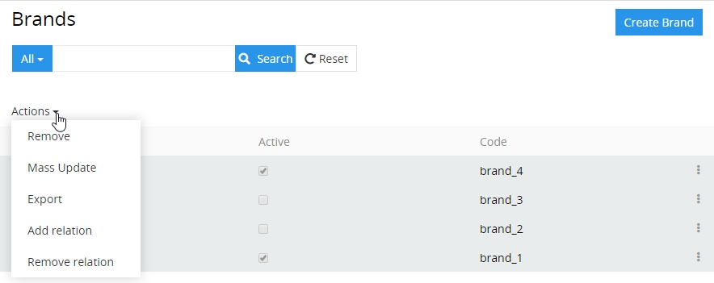
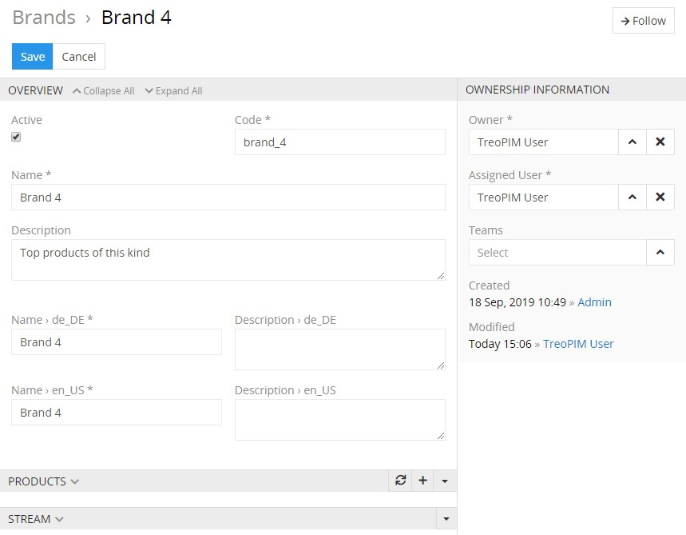
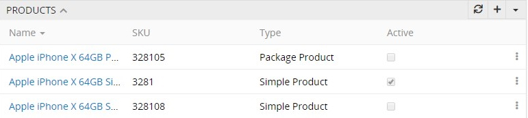
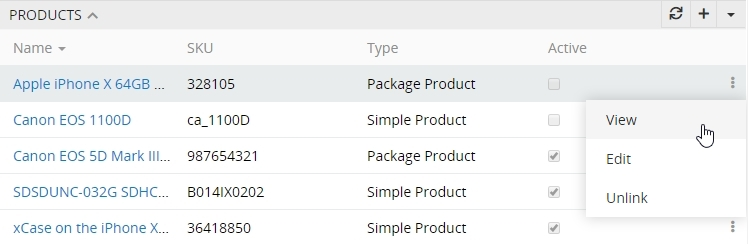

# Brands

**Brand** – a name, term, design, symbol, or other feature that distinguishes the product from its rivals in the eyes of the customer. Brands are used in business, marketing and advertising to increase sales. 

By default, only one brand can be assigned to the product. Brand is optional for the product. It is technically possible to have different brands with same name, because of different IDs that would be assigned to them.

Brands can be activated or deactivated. Deactivated brands cannot be used in the system and are not transferred via any channel.

## Brand Fields

The brand entity comes with the following preconfigured fields; mandatory are marked with *:

| **Field Name**           | **Description**                            |
|--------------------------|--------------------------------------------|
| Active                   | Activity state of the brand record         |
| Name (multi-lang) *      | Name of the brand (e.g. Apple, Nike, etc.) |
| Code *                   | Unique value used to identify the brand. It can only consist of lowercase letters, digits and underscore symbols     |
| Description (multi-lang) | Description of the brand                   |

> If you want to make changes to the brand entity, e.g. add new fields, or modify brand views, please contact your administrator.

## Brands' List View

To open the brands' list view, click the `Brands` option in the navigation menu:

By default the following fields are displayed on the list view page for brands:
 - Active
 - Name
 - Code

To sort brand records, click any sortable column title; this will sort the column either ascending or descending. 

Brands can be searched and filtered according to your needs. For details on the search and filtering options, see the **Search and Filtering Panel** section of the [**User Interface**](https://treopim.com/help/user-interface) article in this user guide.

To create a new brand record, click the `Create Brand` button located in the upper right corner of the brands list view page.

To view some brand record details, click the name field value of the corresponding record in the list of brands; the detail view page will open.

### Mass Actions

The following mass actions are available for brand entities:
- Remove
- Mass update
- Export
- Add relation
- Remove relation

For details on these actions, please, see the **Mass Actions** section of the [**User Interface**](https://treopim.com/help/user-interface#mass-actions) article in this user guide.

### Single Record Actions

The following single record actions are available for brand entities:
- View
- Edit
- Remove

For details on these actions, please, see the **Single Record Actions** section of the [**User Interface**](https://treopim.com/help/user-interface#single-record-actions) article in this user guide.

## Brand's Detail View

Shows the brand records and the records of the related entities.

### Brand Creation / Editing

To create a new brand, click `Brands` in the breadcrumb navigation or in the navigation menu to get to the brand list view and then click the `Create Brand` button. The common creation pop-up window will open:

Here fill in the required fields and activate the new brand, if needed. Click `Save` to finish the brand creation or `Cancel` to abort the process.

Brand editing is available in two ways:
- using the `Edit` button on the detail view page of the currently open brand record;
- via the `Edit` option from the single record actions drop-down menu on the list view page.

Either way will open the editing pop-up window:

Here use the pencil button to enable editing of the desired fields, where possible. Click `Update` to apply your changes.

By design, if a brand is deactivated, all the related products will automatically be deactivated as well. Otherwise, if a brand is activated, all the related products will remain in the previous activity state without any changes. To activate the products linked to this brand, please filter them by this brand and apply the corresponding [mass action](#mass-actions).

### Removing the Brand 

To remove the brand record, use the `Remove` option from the actions drop-down menu or from the single record actions drop-down list.

By default, it is not possible to remove the brand, if there is any product associated with it.

### Duplicating the Brand

Use the `Duplicate` option from the actions drop-down menu to go to the brand creation page and get all the values of the last chosen brand record copied in the empty fields of the new brand record to be created.

## Working with Products Related to the Brand

On each brand page there is a small list view of the products, associated with this brand.

By default, the following fields are displayed in the small detail view for the related products:
 - Name
 - SKU
 - Type
 - Active

To create a new product from this view use the `+` button located on the "Products" panel and enter the necessary data for the entry being created.

To link the already existing products with the given brand, use the `Select` option from the actions drop-down menu located in the upper right corner of the "Products" panel. Then in the "Products" pop-up window choose one or more products you would like to assign to this brand and click the `Select` button.

Please, note that if the product has already been related to other brand, it will be reassigned to a new brand, which is opened in the main window. 

To view the product, click its name in the products list or select the `View` option from the single record actions drop-down list for the appropriate record:

To edit the product, use the `Edit` option from the single record actions drop-down list for the appropriate record. In the editing pop-up window that appears make changes in the desired fields, where possible. Click `Save` to apply your changes.

Use the `Unlink` option from the single record actions drop-down list to unlink the desired record from the brand and confirm your decision in the pop-up that appears.

To remove the product, select the `Remove` option from the single record actions drop-down list for the appropriate record.