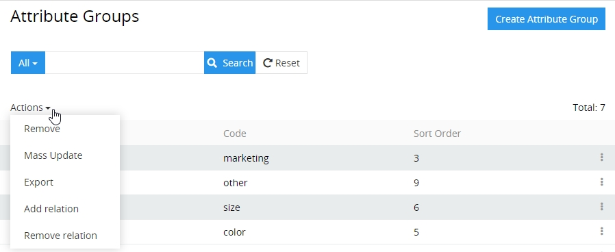
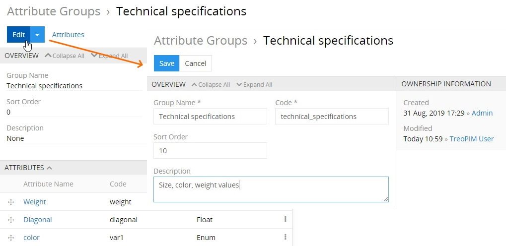
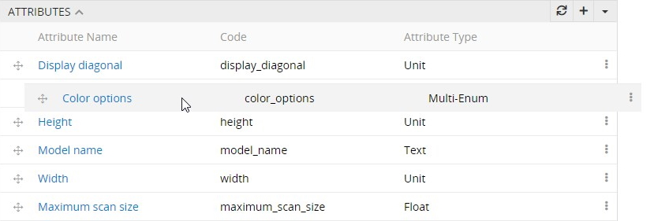
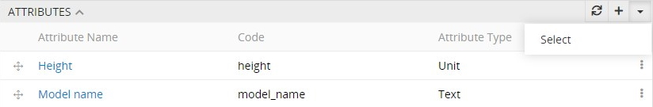
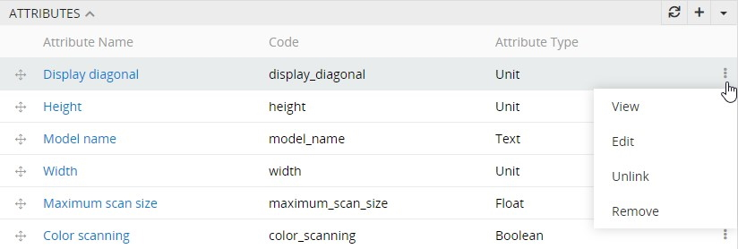

# Attribute Groups

**Attribute Group** – a collection of [attributes](https://treopim.com/help/attributes), which combines attributes of a certain kind together and make it easier for the customer to understand the product and its features better. As an example, the "screen" attribute group for smartphones may combine such attributes as "screen diagonal", "resolution", "type of matrix", "number of touch points", etc. Each attribute may belong to only one attribute group, which is optional.

## Attribute Group Fields

The attribute group entity comes with the following preconfigured fields; mandatory are marked with *:

| **Field Name**           | **Description**                            |
|--------------------------|--------------------------------------------|
| Group name (multi-lang)* | Name of the attribute group (e.g. technical) |
| Code *                   | Unique value used to identify the attribute group. It can only consist of lowercase letters, digits and underscore symbols                   |
| Sort order               | Sorting order of the attribute group. With this parameter, attribute groups will be arranged in the appropriate order on the product detail view page                   |
| Description (multi-lang) | Description of the attribute group purpose   |

>If you want to make changes to the attribute group entity (e.g. add new fields, or modify attribute group views), please contact your administrator. 

## Attribute Groups' List View

To open the attribute groups' list view page, click the "Attribute groups" option in the navigation menu:

By default, the following attribute group fields are displayed on the list view page for attribute groups:
- Group name
- Code
- Sort order

To sort attribute group records, click any sortable column title; this will sort the column either ascending or descending. 

Attribute groups can be searched and filtered according to your needs. For details on the search and filtering options, see the **Search and Filtering Panel** section of the [**User Interface**](https://treopim.com/help/user-interface) article in this user guide.

To create a new attribute group record, click the  button located in the upper right corner of the attribute groups list view page.

To view some attribute group record details, click the name field value of the corresponding record in the list of attribute groups; the detail view page will open.

### Mass Actions

The following mass actions are available for attribute groups:
- Remove
- Mass update
- Export
- Add relation
- Remove relation

For details on these actions, please, see the **Mass Actions** section of the [**User Interface**](https://treopim.com/help/user-interface) article in this user guide.

### Single Record Actions

The following single record actions are available for attribute group entities:
- View
- Edit
- Remove

For details on these actions, please, see the **Single Record Actions** section of the [**User Interface**](https://treopim.com/help/user-interface) article in this user guide.

## Attribute Group's Detail View

### Attribute Group Editing

To edit the opened attribute group, click the "Edit" button and make the desired changes on the editing page that opens:

The "Sort order" parameter defines the attribute group position in the related entity on the product detail view page. Alternatively, attributes order within the given attribute group can be changed via their drag-and-drop:

### Attribute Group Removing

To remove the attribute group, select the corresponding option from the main actions button:

If you are removing the attribute group that contains related attributes, these attributes will be unlinked from this attribute group.

### Attribute Group Duplicating

To duplicate the attribute group, select the "Duplicate" option from the main actions button. A common creation page will open displaying the data fields that contain the values from the open attribute group record. Enter the unique code for the record being duplicated and make other necessary changes and click the "Save" button to complete the action. 

## Working with Attributes, Related to the Attribute Group

On each attribute group detail view page, there is a small list view of the attributes associated with this attribute group, displayed on the "Attributes" panel.

By default, the following fields are displayed on the "Attributes" panel:

- Attribute name
- Code
- Attribute type

To create a new [attribute](https://treopim.com/help/attributes) from this view, сlick the  button and fill in the fields in the creation pop-up window that appears.

To link the already existing attribute(s) with the open attribute group, use the "Select" option:

In the "Attributes" pop-up window that appears select one or several attributes you would like to assign to this attribute group and click the  button to complete the action.

>Please consider, if the attribute has already been related to other attribute group(s), it will be reassigned to the currently open attribute group. 

Using the single record actions drop-down menu for the attribute records, you can view, edit or remove the corresponding record or unlink it from the currently open attribute group:

 

