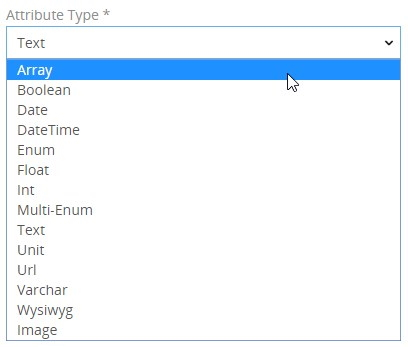
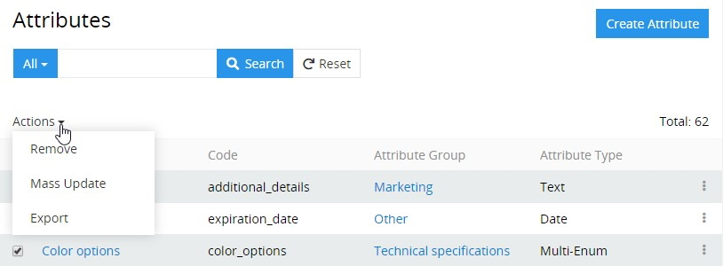
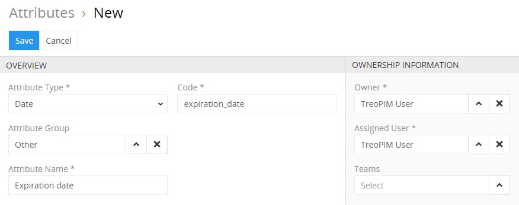
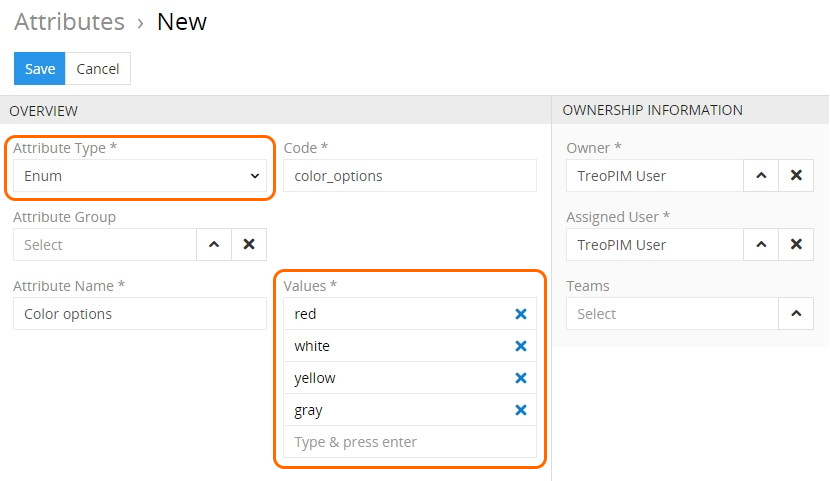
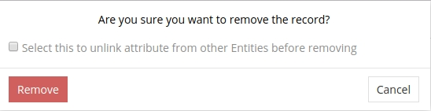

# Attributes

**Attributes** – characteristics of a certain [product](https://treopim.com/help/products) that distinguish it from other products, e.g. size, color, functionality, components and features that affect the product's attractiveness or acceptance in the market. 

An attribute can be assigned to only one [attribute group](https://treopim.com/help/attribute-groups). Value of a certain attribute set for a certain product is called *product attribute value*. It it possible to define the same product attribute different values for each channel. 

Attributes can be assigned to several [product families](https://treopim.com/help/product-families), so it the product for that product family is created, the selected attribute will be added to the product attributes automatically.

Attributes can be activated or deactivated. Deactivated attributes cannot be used in the system, e.g. no values can be set to them or transferred via any channel. All the values of the deactivated attributes are hidden and will be shown again after the attribute is activated again.

## Attribute Fields

The attribute entity comes with the following preconfigured fields; mandatory are marked with *:

| **Field Name**           | **Description**                   |
|--------------------------|-----------------------------------|
| Attribute type           | Attribute types are predefined in the system and can be defined via the drop-down menu                |
| Code *                   | Unique attribute code              |
| Name (multi-lang) *      | Attribute name                     |
| Attribute group          | Attribute group name               |

> If you want to make changes to the attribute entity (e.g. add new fields, or modify attribute views), please contact your administrator.

### Available Attribute Types

Attributes are automatically validated according to their type. The following attribute types are available in the TreoPIM system:

| **Attribute Type**           | **Description**                   |
|------------------------------|-----------------------------------|
| Array                        | Data array, where each product attribute can get more than one value. No array values can be set upon the attribute creation or editing.|
| Boolean                      | Checkbox for the product attribute.
| Date                         | Date picker with the calender and option to set up the date manually.
| DateTime                     | Date and time picker.
| Enum                         | List of possible values, which is set up upon the attribute creation or editing; a single value can be set for the product attribute.
| Float                        | Number with a decimal part.
| Int                          | Integer attribute. 
| Multi-Enum                   | List of possible values, which is set up upon attribute creation or editing; multiple values can be set for the product attribute.
| Text                         | Text area, for long multiline texts.
| Unit                         | Number with a measurement value selection.
| Url                          | URL with a hyperlink, which is automatically created.
| Varchar                      | Short text attribute.
| Varchar Multilang            | Short text attribute with separate values for each locale.
| Text Multilang               | Text area for long multiline texts with separate values for each locale.
| Enum Multilang               | Multilingual list of possible values, which is set up upon the attribute creation or editing; a single value can be set for the product attribute separately for each locale.
| Multi-Enum Multilang         | Multilingual list of possible values, which is set up upon the attribute creation or editing, multiple values can be set for the product attribute separately for each locale.
| Array Multilang              | Multilingual data array, where each product attribute can get more than one value separately for each locale. No array values can be set upon the attribute creation or editing.
| Wysiwyg                      | Text area for long multiline texts that contains a built-in text editor.
| Wysiwyg Multilang            | Text area for long multiline texts that contains a built-in text editor with separate values for each locale.

## Attributes' List View

To open the attributes' list view, click the `Attributes` option in the navigation menu:

By default, the following fields are displayed on the list view page for attributes:
- Attribute name
- Code
- Attribute group
- Attribute type

To sort attribute records, click any sortable column title; this will sort the column either ascending or descending. 

Attributes can be searched and filtered according to your needs. For details on the search and filtering options, see the **Search and Filtering Panel** section of the [**User Interface**](https://treopim.com/help/user-interface#search-and-filtering-panel) article in this user guide.

To create a new attribute record, click the `Create Attribute` button located in the upper right corner of the attributes list view page.

To view some attribute record details, click the name field value of the corresponding record in the list of attributes; the detail view page will open.

### Mass Actions

The following mass actions are available for attribute entities:
- Remove
- Mass update
- Export
- Add relation
- Remove relation

For details on these actions, please, see the **Mass Actions** section of the [**User Interface**](https://treopim.com/help/user-interface) article in this user guide.

### Single Record Actions

The following single record actions are available for attribute entities:
- View
- Edit
- Remove
  
For details on these actions, please, see the **Single Record Actions** section of the [**User Interface**](https://treopim.com/help/user-interface) article in this user guide.

## Attribute's Detail View

To open the attribute's detail view page, click the name of the desired attribute.

### Attribute Creating 

To create a new attribute, click the `Attributes` option in the breadcrumb navigation or in the navigation menu to get to the attribute list view and then click the `Create Attribute` button. The common creation pop-up window will appear:

Here enter the attribute name and code and select its type from the `Attribute Type` drop-down list. Define its attribute group using the corresponding select button, if needed. Your username is loaded to the `Owner` and `Assigned user` fields by default. You can change them via the corresponding select buttons, as well as define the team, if needed. Click `Save` to finish the attribute creation or `Cancel` to abort the process.

> Please, note that attribute type cannot be changed after the attribute is created. 

When creating attributes of the `Enum`, `Multi-Enum`, `Enum Multilang`, and `Multi-Enum Multilang` types their attribute values should also be defined:

### Attribute Editing

Attribute editing is available in two ways:
- using the `Edit` button on the detail view page of the currently open attribute record;
- via the `Edit` option from the single record actions drop-down menu on the list view page.

Either way will open the editing pop-up window, where you can make any changes needed. 

### Attribute Removing

To remove the attribute record, use the `Remove` option from the actions drop-down menu or from the single record actions drop-down list.

By default, it is not possible to remove the attribute if there is any product or product family linked with this attribute. The following confirmation pop-up appears:

Select the checkbox to to unlink the attribute from other entities and click `Remove` to complete the operation. Click `Cancel` to abort the process. 

### Attribute Duplicating

Use the `Duplicate` option from the actions drop-down menu to go to the attribute creation page and get all the values of the last chosen attribute record copied in the empty fields of the new attribute record to be created.

