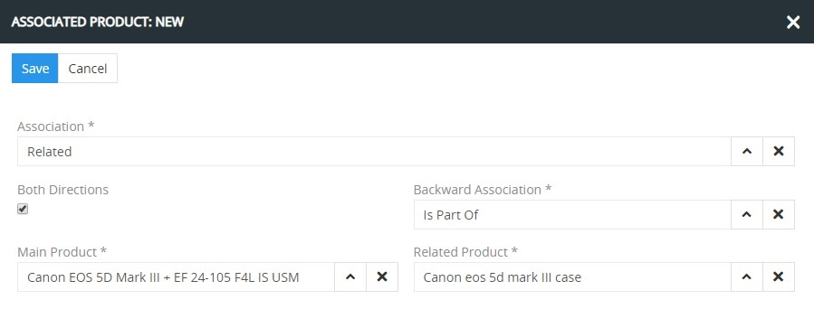
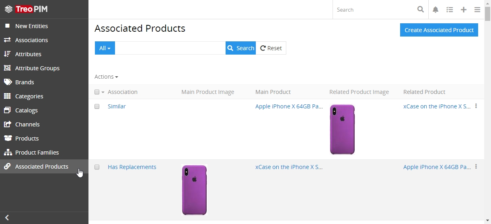
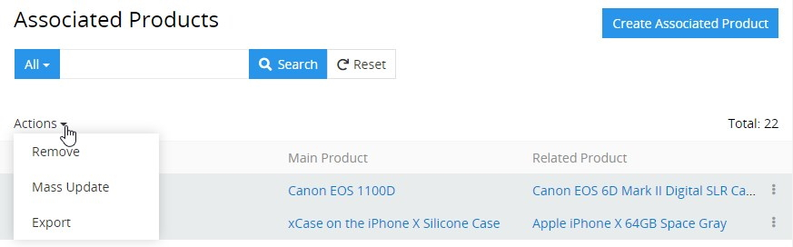
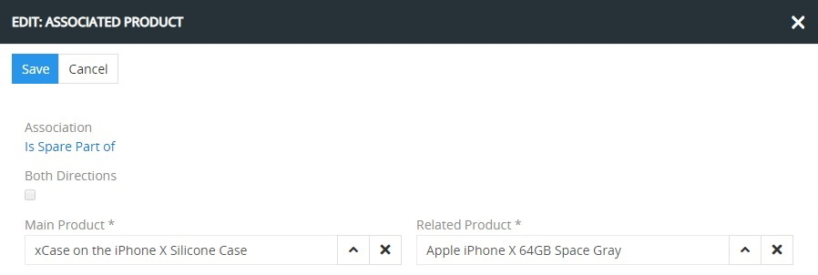
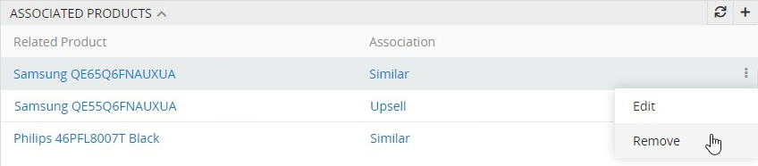
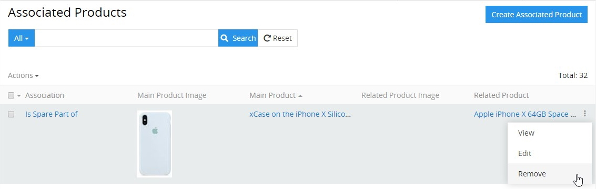

# Associated Products

**Associated Products** – two products, which are related within a certain association. So there is a Main Product and a Related Product. Related products are not automatically cross-linked, so if product A (main product) is related to product B (associated product), it does not mean that product B is automatically related to product A. 

The option to create associated products targets on increasing sales and helping in promotion and marketing of new products, but has a slightly different configuration process.

TreoPIM comes with the following predefined associations:

- **Up-sell products** are the products with higher price and quality, which could be more popular with shoppers and more profitable for the sellers. Up-sell products are generally packed with special features or other competitive advantages to encourage customers to change their mind and buy these ones. 

- **Cross-sell products** are complementary products, which could be bought in addition to the main one. Good examples are cases or smartphone covers that can be offered to a shopper, who is buying a smartphone. These are the products the customer would probably also look for.

- **Related products** are usually products of the same category and type as the selected product or service. These are competitive alternatives to provide the customer with a wide number of options in addition to the main product. Sometimes related products are useful for promotion of less popular products or for attracting customers' attention to possible alternatives.

## Associated Product Fields

The `Associated Product` entity record comes with the following preconfigured fields; mandatory are marked with *:

| **Field Name**           | **Description**                   |
|--------------------------|-----------------------------------|
| Association *            | Association name within which the products are related           |
| Both directions          | Association direction type of the record: one- or two-way      |
| Backward association * *(if `Both directions` is enabled)*   | Backward association name         |
| Main product *           | The main product name |
| Related product *           | The related product name |

> If you want to make changes to the associated product entity, e.g. add new fields, or modify associated product views, please contact your administrator.

## Creating

To create a new associated product record, click `Associated Products` in the breadcrumb navigation or in the navigation menu to get to the associated products [list view](#listing) and then click the `Create Associated Product` button. The common creation  pop-up will appear:

Here fill in all the required fields for the entry being created. Select the `Both directions` checkbox to make the association **two-way** – when product A is associated with product B; and vice versa, product B is associated with product A. Leave this checkbox unselected to make the association **one-way** – when product A is associated with product B, but not vice versa.

*If a [backward association](https://treopim.com/help/associations) is defined for the association entry within which the products are related, the `Both directions` checkbox will be selected by default with the backward association name displayed in the corresponding field.*

Alternatively, use `+` button on the "Associated products" panel of the [product](https://treopim.com/help/products) detail view page or the quick create button on any TreoPIM page and fill in the required fields in the associated product creation pop-up that appears. Please, note that the "Associated Products" panel of the product detail view page displays which products are in relation with the currently opened product and within which association.

## Listing

To open the list of associated products available in the system, click `Associated Products` in the navigation menu:

By default, the following fields are displayed on the [list view](https://treopim.com/help/views-and-panels#list-view) page for the associated products:

- Association
- Main product image
- Main product
- Related product image
- Related product

To change the associated product records order in the list, click any sortable column title; this will sort the column either ascending or descending.

Associated products can be searched and filtered according to your needs. For details on the search and filtering options, refer to the [**Search and Filtering**](https://treopim.com/help/search-and-filtering) article in this user guide.

To view the associated product record details, use the `View` option from the single record actions menu for the appropriate entry on the "Associated Products" list view page. 

### Mass Actions

The following mass actions are available for associated product entities:
- Remove
- Mass update
- Export

For details on these actions, please, see the **Mass Actions** section of the [**User Interface**](https://treopim.com/help/user-interface#mass-actions) article in this user guide.

### Single Record Actions

The following single record actions are available for the associated product entities:
- View
- Edit
- Remove
  
For details on these actions, please, see the **Single Record Actions** section of the [**User Interface**](https://treopim.com/help/user-interface#single-record-actions) article in this user guide.

## Editing

To edit the associated product, use the `Edit` option from the single record actions menu for the appropriate record on the associated products list view page; the following editing pop-up will appear:

Here edit the desired fields and click the `Save` button to apply your changes.

Alternatively, make changes to the desired associated product record in the [quick edit](https://treopim.com/help/views-and-panels#quick-edit-view) pop-up that appears when you select the `Edit` option from the single record actions menu on the "Associated products" panel of the product detail view page. 

## Removing

To remove the associated product record, select the `Remove` option from the single record actions menu for the appropriate record on the associated products list view page 

or on the "Associated products" panel of the product detail view page:

