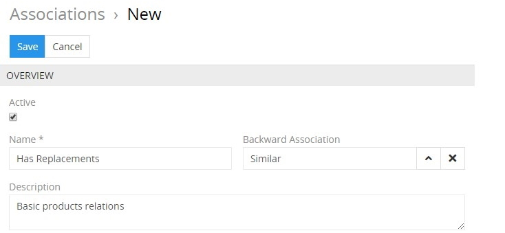
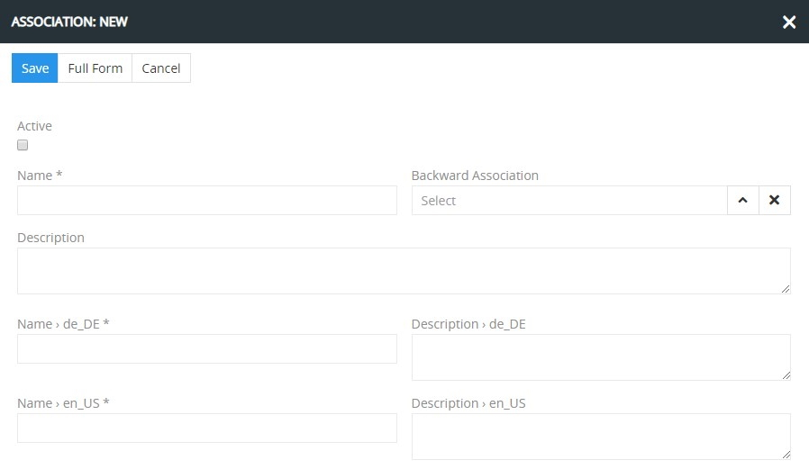
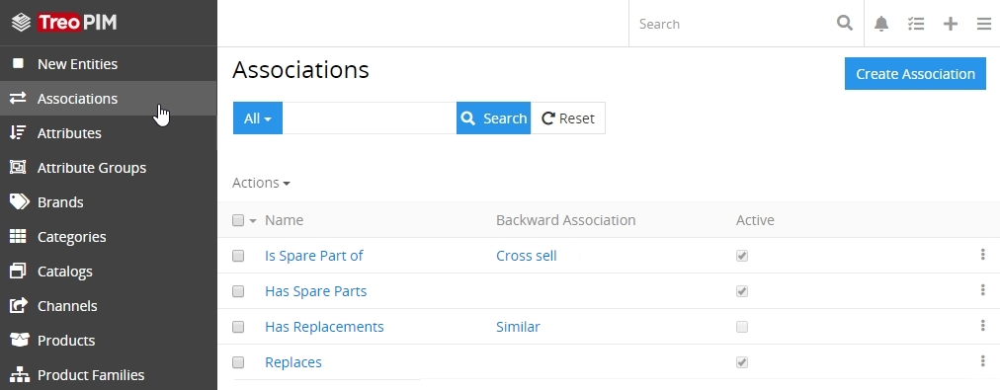
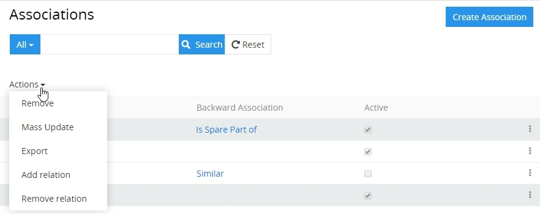
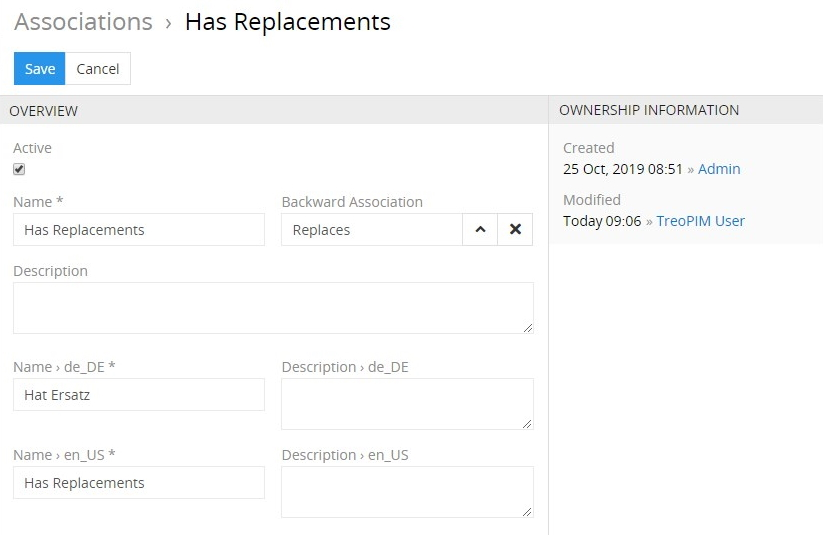
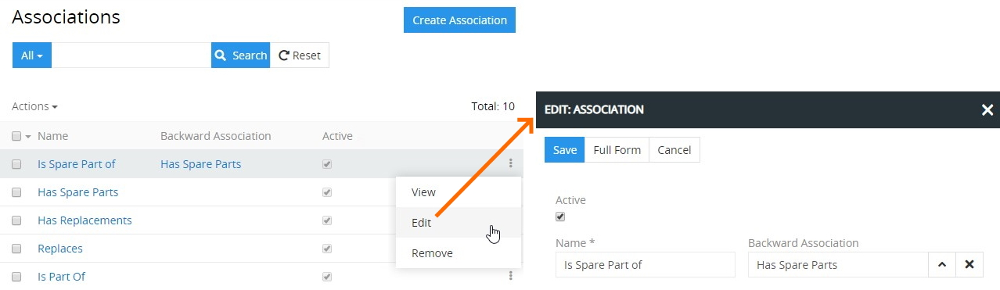
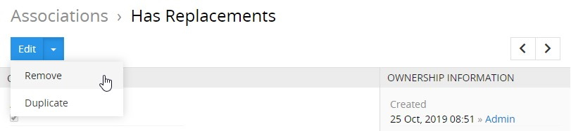

# Associations

**Association** – a type of the relationship between products, where one in some way is dependent on the other one(s), or can influence the other one(s) in accordance with different marketing strategies (e.g cross-sell, up-sell, etc.). Each product can associate different products and can be associated from different products.

Associations can be activated and deactivated. Deactivated associations cannot be used in the system, i.e. all records of the associated products will not be transferred via any channel.

## Association Fields

The association entity comes with the following preconfigured fields; mandatory are marked with *:

| **Field Name**           | **Description**                   |
|--------------------------|-----------------------------------|
| Active                   | Activity state of the record      |
| Name (multi-lang) *      | Association name, e.g. сross-sell |
| Backward association     | Backward association name         |
| Description (multi-lang) | The aim of this association usage |

If you want to make changes to the association entity (e.g. add new fields, or modify association views), please contact your administrator.

## Creating

To create a new association, click `Associations` in the breadcrumb navigation or in the navigation menu to get to the association [list view](#listing) and then click the `Create Association` button. The common creation window will open:

Here enter the association name and description (optional); activate the new association, if needed. Define its backward association using the corresponding select button. Click the `Save` button to finish the association creation or `Cancel` to abort the process.

Alternatively, use the quick create button on any TreoPIM page and fill in the required fields in the association creation pop-up that appears:

For more details on backward associations, please, refer to the [**Associated Products**](https://treopim.com/help/associated-products) article in this user guide.

## Listing

To open the list of associations available in the system, click the `Associations` option in the navigation menu:

By default, the following fields are displayed on the [list view](https://treopim.com/help/views-and-panels) page for associations:
 - Name
 - Backward association
 - Active

To change the association records order in the list, click any sortable column title; this will sort the column either ascending or descending. 

Associations can be searched and filtered according to your needs. For details on the search and filtering options, refer to the [**Search and Filtering**](https://treopim.com/help/search-and-filtering) article in this user guide.

To view some association record details, click the name field value of the corresponding record in the list of associations; the detail view page will open showing the association records and the records of the related entities. Alternatively, use the `View` option from the single record actions menu to open the [quick detail](https://treopim.com/help/views-and-panels) pop-up.

### Mass Actions

The following mass actions are available for association entities on the list view page:
- Remove
- Mass update
- Export
- Add relation
- Remove relation

For details on these actions, please, see the **Mass Actions** section of the [**Views and Panels**](https://treopim.com/help/views-and-panels) article in this user guide.

### Single Record Actions

The following single record actions are available for association entities on the list view page:
- View
- Edit
- Remove

For details on these actions, please, refer to the **Single Record Actions** section of the [**Views and Panels**](https://treopim.com/help/views-and-panels) article in this user guide.

## Editing

To edit the association, click the `Edit` button on the detail view page of the currently open association record; the following editing window will open:

Here edit the desired fields and click the `Save` button to apply your changes.

Besides, you can make changes in the association record via [in-line editing](https://treopim.com/help/views-and-panels) on its detail view page.

Alternatively, make changes to the desired association record in the [quick edit](https://treopim.com/help/views-and-panels) pop-up that appears when you select the `Edit` option from the single record actions menu on the associations list view page:

## Removing

To remove the association record, use the `Remove` option from the actions menu on its detail view page

or from the single record actions menu on the associations list view page:

By default, it is not possible to remove the association, if there is any product associated with it.

## Duplicating

Use the `Duplicate` option from the actions drop-down menu to go to the association creation page and get all the values of the last chosen association record copied in the empty fields of the new association record to be created. Modifying the association code is required, as this value has to be unique.

## Working with Associated Products

[Associated products](https://treopim.com/help/associated-products) are related to the associations and are shown as a [small list view](https://treopim.com/help/views-and-panels) on each product page and include the following table columns:

 - Related product image
 - Related product
 - Association

TreoPIM also offers you the ability to add associations to all the products (or as many as needed) simultaneously via the [mass actions](https://treopim.com/help/views-and-panels) menu.

