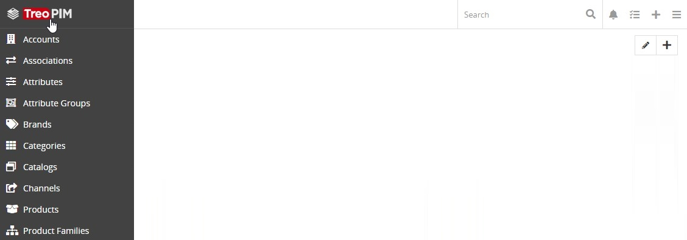
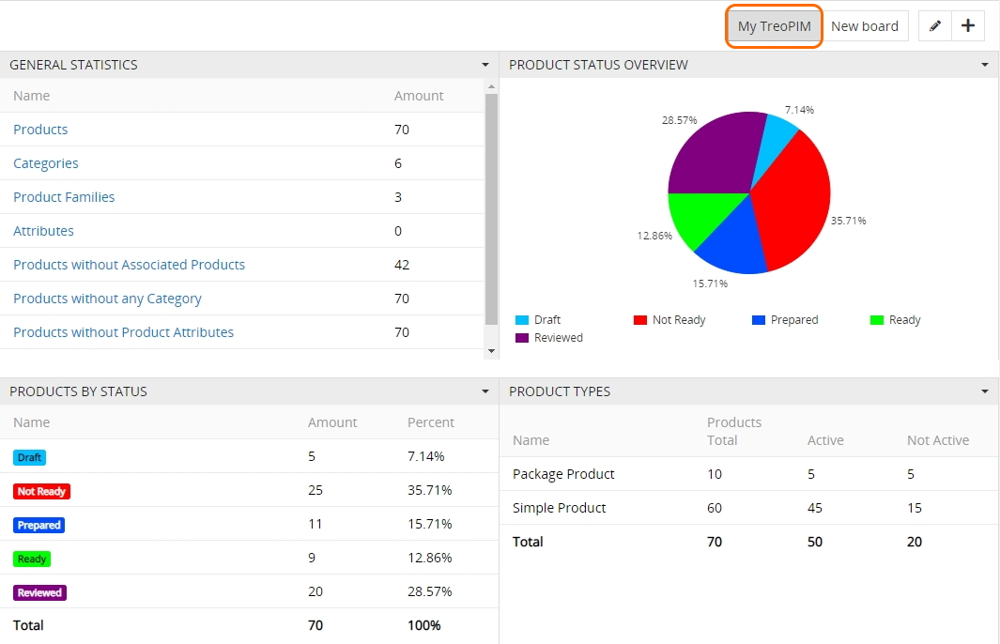

# Dashboard

The dashboard is the default starting page of TreoPIM:

The "My TreoPIM" dashboard comes out-of-the-box and is displayed on the TreoPIM starting page by default.

Dashboards are [user customizable](https://treopim.com/help/user-interface#user-interface-settings), i.e. users can add, rename and delete dashboards, as well as modify the dashboard layout.

Once the dashboard is created, user can easily access it by clicking its name in the upper right corner of the TreoPIM starting page:
<!-- probably has to be changed to contain dif-nt dashlets -->

Creating new dashboards is useful if you wish to group a different set of dashlets, consisting of certain information of the same nature or type, to help you make the right decision.

<!-- copied from the UI article - has to be modified + make screens
Using the `+` button add as many dashlets as you need. The added dashlets can be resized using the double-headed arrow in the bottom right corner of each dashlet. Click `Edit` to modify the added dashlets, if needed.

To rearrange your dashboard view, drag-and-drop the dashlets right on the "User interface" panel:
-->

## Dashlets

Dashlets are [user-configurable](https://treopim.com/help/user-interface#user-interface-settings) blocks, which can be placed via drag-and-drop anywhere on the dashboard, giving you a quick overview of your records and activity. 

Dashlets provide users with valuable information regarding records of specific entities.

### Available Dashlets

The following dashlets are available in TreoPIM out-of-the-box:
- Channels
- General Statistics
- My Inbox
- Product Status Overview
- Product Types
- Product by Status
- Product by Tag
- Record List
- Stream
